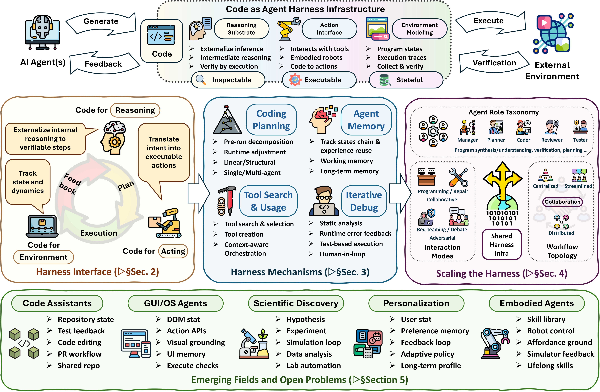
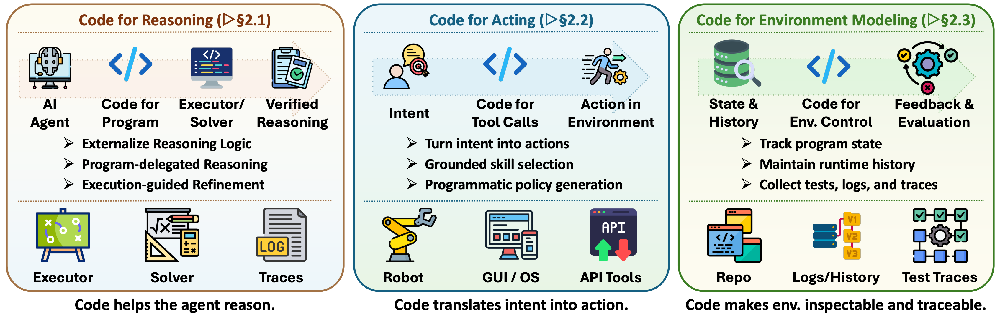
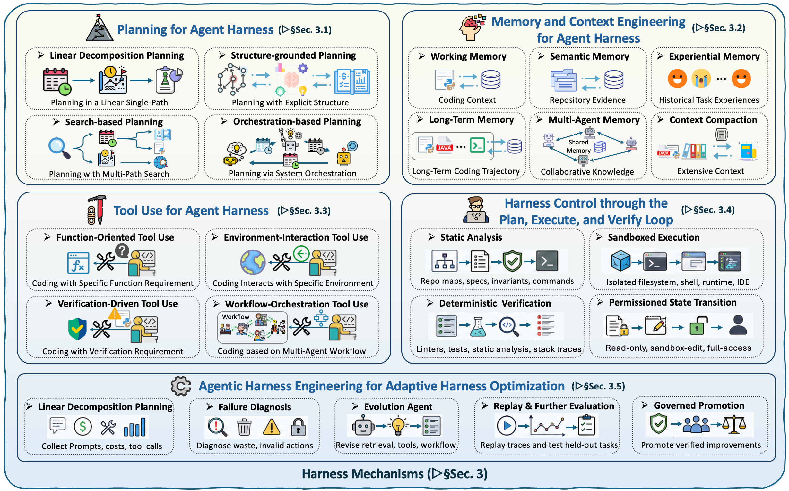
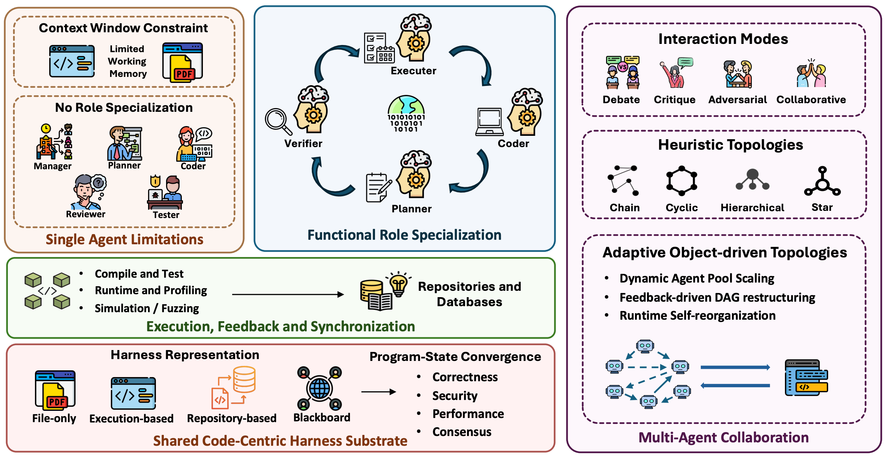
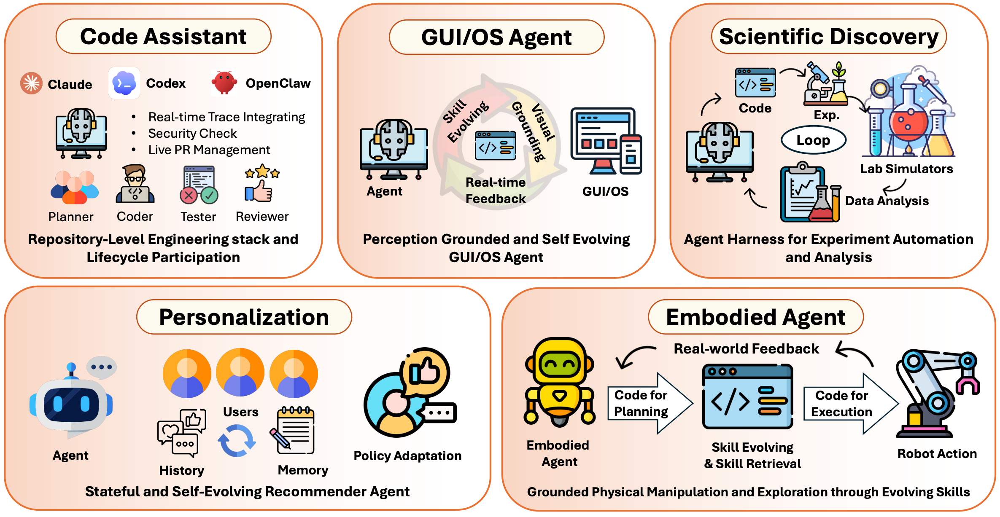

# Awesome Code as Agent Harness Papers

[](https://awesome.re)
[](https://arxiv.org/abs/2605.18747)
[](https://opensource.org/licenses/MIT)
[](#-contributing)


This repository accompanies the survey [**Code as Agent Harness: Toward Executable, Verifiable, and Stateful Agent Systems**](https://arxiv.org/abs/2605.18747).
We study the emerging role of code in agentic AI: code is no longer only a generated artifact, but increasingly serves as an executable, inspectable, and stateful harness through which agents reason, act, model environments, receive feedback, and coordinate. The repository organizes representative papers around three connected layers: **Harness Interface**, **Harness Mechanisms**, and **Scaling the Harness**, covering directions such as coding assistants, GUI/OS automation, scientific discovery, and embodied intelligence.

> [!TIP]
> 👋 We welcome paper suggestions, pull requests, and collaborations on code as agent harness. Please contact us at `xuyingn2@illinois.edu`, `kt42@illinois.edu`, `twei10@illinois.edu`, `zihaoli5@illinois.edu`, and `bei4@illinois.edu`. We will keep updating this repository with recent work on code-centric agentic systems and harness engineering.

> [!NOTE]
> 📚 If you find this resource useful, please cite and [](https://github.com/YennNing/Awesome-Code-as-Agent-Harness-Papers) the repo:
>
>
> ```bibtex
> @article{ning2026codeasharness,
>   title   = {Code as Agent Harness: Toward Executable, Verifiable, and Stateful Agent Systems},
>   author  = {Ning, Xuying and Tieu, Katherine and Fu, Dongqi and Wei, Tianxin and Li, Zihao and Bei, Yuanchen and others},
>   journal = {arXiv preprint arXiv:2605.18747},
>   year    = {2026}
> }
> ```



## 🔔 News

**[2026-05]** 🚀 Our survey ***Code as Agent Harness: Toward Executable, Verifiable, and Stateful Agent Systems*** is available on [arXiv](https://arxiv.org/abs/2605.18747). Slides and project page links will be added here once available.

## 📋 Table of Contents

- [🔔 News](#-news)
- [📋 Table of Contents](#-table-of-contents)
- [🧩 Harness Interface](#-harness-interface)
  - [💭 Code for Reasoning](#-code-for-reasoning)
  - [🤖 Code for Acting](#-code-for-acting)
  - [🌍 Code for Environment Modeling](#-code-for-environment-modeling)
- [🛠️ Harness Mechanisms](#%EF%B8%8F-harness-mechanisms)
  - [🗺️ Planning for Code Agents](#%EF%B8%8F-planning-for-code-agents)
  - [🧠 Memory and Context Engineering](#-memory-and-context-engineering)
  - [🔧 Tool Usage for Code Agents](#-tool-usage-for-code-agents)
  - [🧪 Feedback-Guided Iterative Debugging](#-feedback-guided-iterative-debugging)
- [👥 Scaling the Harness: Multi-Agent Code-Centric Systems](#-scaling-the-harness-multi-agent-code-centric-systems)
  - [🎭 Functional Role Specialization](#-functional-role-specialization)
  - [💬 Interaction Modes](#-interaction-modes)
  - [🕸️ Workflow Topology](#%EF%B8%8F-workflow-topology)
  - [⚡ Execution Feedback Integration](#-execution-feedback-integration)
  - [🔄 Shared-Harness Synchronization](#-shared-harness-synchronization)
  - [🏛️ Shared Harness Representation](#%EF%B8%8F-shared-harness-representation)
  - [🎯 Harness-State Convergence](#-harness-state-convergence)
- [🚀 Applications and Emerging Fields](#-applications-and-emerging-fields)
  - [💻 Code Assistants](#-code-assistants)
  - [🖥️ GUI / OS Agents](#%EF%B8%8F-gui--os-agents)
  - [🔬 Scientific Discovery Agents](#-scientific-discovery-agents)
  - [🤖 Autonomous Embodied Agents](#-autonomous-embodied-agents)

---

## 🧩 Harness Interface

Code as the basic interface between a model and its task environment. Programs convert model outputs into executable, inspectable, and stateful structures: code makes reasoning *executable*, action *programmable*, and environment state *inspectable*.



### 💭 Code for Reasoning

Programs externalize internal logic into verifiable computation, allowing interpreters, symbolic solvers, execution traces, or process rewards to check and refine intermediate steps.

#### Program-Delegated Reasoning

| Paper | Venue |
| --- | --- |
| [Program of Thoughts Prompting: Disentangling Computation from Reasoning for Numerical Reasoning Tasks](https://arxiv.org/abs/2211.12588) | TMLR 2023 |
| [MathCoder: Seamless Code Integration in LLMs for Enhanced Mathematical Reasoning](https://arxiv.org/abs/2310.03731) | ICLR 2024 |
| [Chain of Code: Reasoning with a Language Model-Augmented Code Emulator](https://arxiv.org/abs/2312.04474) | ICML 2024 |
| [Method-Based Reasoning for Large Language Models: Extraction, Reuse, and Continuous Improvement](https://arxiv.org/abs/2508.04289) | arXiv 2025 |
| [Code-Enabled Language Models Can Outperform Reasoning Models on Diverse Tasks](https://arxiv.org/abs/2510.20909) | arXiv 2025 |
| [When Do Program-of-Thought Works for Reasoning?](https://ojs.aaai.org/index.php/AAAI/article/view/29721) | AAAI 2024 |
| [PAL: Program-aided Language Models](https://proceedings.mlr.press/v202/gao23f.html) | ICML 2023 |
| [Show Your Work: Scratchpads for Intermediate Computation with Language Models](https://arxiv.org/abs/2112.00114) | arXiv 2021 |
| [Reasoning Like Program Executors](https://aclanthology.org/2022.emnlp-main.48/) | EMNLP 2022 |
| [Towards Better Understanding of Program-of-Thought Reasoning in Cross-Lingual and Multilingual Environments](https://aclanthology.org/2025.findings-acl.817/) | ACL 2025 Findings |
| [Chain-of-Thought Prompting Elicits Reasoning in Large Language Models](https://openreview.net/forum?id=_VjQlMeSB_J) | NeurIPS 2022 |

#### Hybrid Symbolic–Neural Execution

| Paper | Venue |
| --- | --- |
| [Self-Verifying Reflection Helps Transformers with CoT Reasoning](https://neurips.cc/virtual/2025/poster/119948) | NeurIPS 2025 |
| [SSR: Socratic Self-Refine for Large Language Model Reasoning](https://arxiv.org/abs/2511.10621) | arXiv 2025 |
| [CodeSteer: Symbolic-Augmented Language Models via Code/Text Guidance](https://arxiv.org/abs/2502.04350) | ICML 2025 |
| [Graph of Thoughts: Solving Elaborate Problems with Large Language Models](https://ojs.aaai.org/index.php/AAAI/article/view/29720) | AAAI 2024 |
| [Code-as-Symbolic-Planner: Foundation Model-Based Robot Planning via Symbolic Code Generation](https://arxiv.org/abs/2503.01700) | IROS 2025 |

#### Iterative Code-Grounded Reasoning

| Paper | Venue |
| --- | --- |
| [NExT: Teaching Large Language Models to Reason about Code Execution](https://arxiv.org/abs/2404.14662) | ICML 2024 |
| [What I cannot execute, I do not understand: Training and Evaluating LLMs on Program Execution Traces](https://arxiv.org/abs/2503.05703) | arXiv 2025 |
| [Reasoning Through Execution: Unifying Process and Outcome Rewards for Code Generation](https://arxiv.org/abs/2412.15118) | ICML 2025 |
| [CodeRL+: Improving Code Generation via Reinforcement with Execution Semantics Alignment](https://arxiv.org/abs/2510.18471) | arXiv 2025 |
| [RLTF: Reinforcement Learning from Unit Test Feedback](https://arxiv.org/abs/2307.04349) | TMLR 2023 |
| [RLEF: Grounding Code LLMs in Execution Feedback with Reinforcement Learning](https://arxiv.org/abs/2410.02089) | ICML 2025 |
| [Execution guided line-by-line code generation](https://openreview.net/forum?id=ySFDPoiANu) | NeurIPS 2025 |
| [R1-Code-Interpreter: LLMs Reason with Code via Supervised and Multi-stage Reinforcement Learning](https://arxiv.org/abs/2505.21668) | arXiv 2025 |
| [CYCLE: Learning to Self-Refine the Code Generation](https://dl.acm.org/doi/full/10.1145/3649825) | OOPSLA 2024 |
| [StepCoder: Improve Code Generation with Reinforcement Learning from Compiler Feedback](https://aclanthology.org/2024.acl-long.251/) | ACL 2024 |
| [CodeRL: Mastering Code Generation through Pretrained Models and Deep Reinforcement Learning](https://openreview.net/forum?id=WaGvb7OzySA) | NeurIPS 2022 |
| [CodePRM: Execution Feedback-enhanced Process Reward Model for Code Generation](https://aclanthology.org/2025.findings-acl.428/) | ACL 2025 Findings |
| [SatLM: Satisfiability-Aided Language Models Using Declarative Prompting](https://openreview.net/forum?id=8tt9KxyV2s) | NeurIPS 2023 |
| [Self-Edit: Fault-Aware Code Editor for Code Generation](https://aclanthology.org/2023.acl-long.45/) | ACL 2023 |

### 🤖 Code for Acting

Generated programs serve as policies, tool calls, behavior trees, or reusable skills for embodied, GUI, software, and tool-use environments.

#### Grounded Skill Selection

| Paper | Venue |
| --- | --- |
| [Do As I Can, Not As I Say: Grounding Language in Robotic Affordances](https://arxiv.org/abs/2204.01691) | CoRL 2022 |
| [Robots That Ask for Help: Uncertainty Alignment for Large Language Model Planners](https://arxiv.org/abs/2307.01928) | CoRL 2023 |
| [Bootstrap Your Own Skills: Learning to Solve New Tasks with Large Language Model Guidance](https://arxiv.org/abs/2310.10021) | CoRL 2023 |
| [SkillVLA: Tackling Combinatorial Diversity in Dual-Arm Manipulation via Skill Reuse](https://arxiv.org/abs/2603.03836) | arXiv 2026 |
| [Scaling Up and Distilling Down: Language-Guided Robot Skill Acquisition](https://proceedings.mlr.press/v229/ha23a.html) | CoRL 2023 |
| [Lifelong Robot Library Learning: Bootstrapping Composable and Generalizable Skills for Embodied Control with Language Models](https://ieeexplore.ieee.org/document/10611448/) | ICRA 2024 |

#### Programmatic Policy Generation

| Paper | Venue |
| --- | --- |
| [RoboCodeX: Multimodal Code Generation for Robotic Behavior Synthesis](https://arxiv.org/abs/2402.16117) | ICML 2024 |
| [CP-Agent: Agentic Constraint Programming](https://arxiv.org/abs/2508.07468) | arXiv 2025 |
| [LLM-Driven Corrective Robot Operation Code Generation with Static Text-Based Simulation](https://arxiv.org/abs/2512.02002) | ICRA 2026 |
| [NormCode: A Semi-Formal Language for Auditable AI Planning](https://arxiv.org/abs/2512.10563) | arXiv 2025 |
| [ALRM: Agentic LLM for Robotic Manipulation](https://arxiv.org/abs/2601.19510) | arXiv 2026 |
| [RACAS: Controlling Diverse Robots With a Single Agentic System](https://arxiv.org/abs/2603.05621) | arXiv 2026 |
| [ReAct: Synergizing Reasoning and Acting in Language Models](https://openreview.net/forum?id=WE_vluYUL-X) | ICLR 2023 |
| [GenSwarm: Scalable Multi-Robot Code-Policy Generation and Deployment via Language Models](https://www.nature.com/articles/s44182-025-00065-w) | npj Robotics 2026 |
| [Code as Policies: Language Model Programs for Embodied Control](https://ieeexplore.ieee.org/document/10160591/) | ICRA 2023 |
| [Robotic Programmer: Video Instructed Policy Code Generation for Robotic Manipulation](https://arxiv.org/abs/2501.04268) | arXiv 2025 |
| [Code-BT: A Code-Driven Approach to Behavior Tree Generation for Robot Tasks Planning with Large Language Models](https://www.ijcai.org/proceedings/2025/980) | IJCAI 2025 |

#### Lifelong Code-Based Agents

| Paper | Venue |
| --- | --- |
| [Growing with Your Embodied Agent: A Human-in-the-Loop Lifelong Code Generation Framework for Long-Horizon Manipulation Skills](https://arxiv.org/abs/2509.18597) | arXiv 2025 |
| [ViReSkill: Vision-Grounded Replanning with Skill Memory for LLM-Based Planning in Lifelong Robot Learning](https://arxiv.org/abs/2509.24219) | arXiv 2025 |
| [UI-Voyager: A Self-Evolving GUI Agent Learning via Failed Experience](https://arxiv.org/abs/2603.24533) | arXiv 2026 |
| [Voyager: An Open-Ended Embodied Agent with Large Language Models](https://openreview.net/forum?id=ehfRiF0R3a) | TMLR 2023 |
| [Lifelong Language-Conditioned Robotic Manipulation Learning](https://arxiv.org/abs/2603.05160) | arXiv 2026 |

### 🌍 Code for Environment Modeling

Program states, repositories, traces, simulators, and tests represent state, dynamics, and feedback signals for agent interaction.

#### Structured World Representations

| Paper | Venue |
| --- | --- |
| [From Programs to Poses: Factored Real-World Scene Generation via Learned Program Libraries](https://openreview.net/forum?id=Ew8bJkSt3g) | NeurIPS 2025 |
| [PoE-World: Compositional World Modeling with Products of Programmatic Experts](https://openreview.net/forum?id=obwRcksFZw) | NeurIPS 2025 |
| [Code2World: A GUI World Model via Renderable Code Generation](https://arxiv.org/abs/2602.09856) | arXiv 2026 |
| [Code2Worlds: Empowering Coding LLMs for 4D World Generation](https://arxiv.org/abs/2602.11757) | arXiv 2026 |
| [ViStruct: Visual Structural Knowledge Extraction via Curriculum Guided Code-Vision Representation](https://aclanthology.org/2023.emnlp-main.824/) | EMNLP 2023 |

#### Execution-Trace World Modeling

| Paper | Venue |
| --- | --- |
| [SemCoder: Training Code Language Models with Comprehensive Semantics Reasoning](https://arxiv.org/abs/2406.01006) | NeurIPS 2024 |
| [CWM: An Open-Weights LLM for Research on Code Generation with World Models](https://arxiv.org/abs/2510.02387) | arXiv 2025 |
| [Reinforcement World Model Learning for LLM-based Agents](https://arxiv.org/abs/2602.05842) | arXiv 2026 |
| [Agent World Model: Infinity Synthetic Environments for Agentic Reinforcement Learning](https://arxiv.org/abs/2602.10090) | arXiv 2026 |
| [Aligning Agentic World Models via Knowledgeable Experience Learning](https://arxiv.org/abs/2601.13247) | arXiv 2026 |
| [WorldCoder, a Model-Based LLM Agent: Building World Models by Writing Code and Interacting with the Environment](https://proceedings.neurips.cc/paper_files/paper/2024/file/820c61a0cd419163ccbd2c33b268816e-Paper-Conference.pdf) | NeurIPS 2024 |

#### Code-Grounded Evaluation Environments

| Paper | Venue |
| --- | --- |
| [CRUXEval: A Benchmark for Code Reasoning, Understanding and Execution](https://arxiv.org/abs/2401.03065) | ICML 2024 |
| [LiveCodeBench: Holistic and Contamination Free Evaluation of Large Language Models for Code](https://openreview.net/forum?id=chfJJYC3iL) | ICLR 2025 |
| [SWE-bench: Can Language Models Resolve Real-world Github Issues?](https://arxiv.org/abs/2310.06770) | ICLR 2024 |
| [AgentBench: Evaluating LLMs as Agents](https://arxiv.org/abs/2308.03688) | ICLR 2024 |
| [CoRe: Benchmarking LLMs' Code Reasoning Capabilities through Static Analysis Tasks](https://neurips.cc/virtual/2025/poster/121601) | NeurIPS 2025 |
| [Geogrambench: Benchmarking the geometric program reasoning in modern llms](https://arxiv.org/abs/2505.17653) | arXiv 2025 |
| [CodeGlance: Understanding Code Reasoning Challenges in LLMs through Multi-Dimensional Feature Analysis](https://arxiv.org/abs/2602.13962) | arXiv 2026 |
| [Endless Terminals: Scaling RL Environments for Terminal Agents](https://arxiv.org/abs/2601.16443) | arXiv 2026 |
| [Reflexion: Language Agents with Verbal Reinforcement Learning](https://openreview.net/forum?id=vAElhFcKW6) | NeurIPS 2023 |
| [CRUXEval-X: A Benchmark for Multilingual Code Reasoning, Understanding and Execution](https://aclanthology.org/2025.acl-long.1158/) | ACL 2025 |
| [InterCode: Standardizing and Benchmarking Interactive Coding with Execution Feedback](https://proceedings.neurips.cc/paper_files/paper/2023/hash/4b175d846fb008d540d233c188379ff9-Abstract-Datasets_and_Benchmarks.html) | NeurIPS 2023 |

## 🛠️ Harness Mechanisms

Once code is placed inside the agent loop, the harness must decide *what to execute next*, *preserve useful state*, *expose the right tools*, and *convert failures into corrective actions*.



### 🗺️ Planning for Code Agents

Planning is harness control: it structures how the agent externalizes intent into executable steps, schedules interactions with code artifacts and tools, and regulates the trajectory of reasoning, execution, and revision over time.

#### Linear Decomposition Planning

| Paper | Venue |
| --- | --- |
| [A Real-World WebAgent with Planning, Long Context Understanding, and Program Synthesis](https://arxiv.org/abs/2307.12856) | ICLR 2024 |
| [ReAct: Synergizing Reasoning and Acting in Language Models](https://openreview.net/forum?id=WE_vluYUL-X) | ICLR 2023 |
| [Self-planning Code Generation with Large Language Models](https://dl.acm.org/doi/10.1145/3672456) | TOSEM 2024 |
| [Knowledge-Aware Code Generation with Large Language Models](https://arxiv.org/abs/2401.15940) | arXiv 2024 |
| [PaT: Planning-after-Trial for Efficient Test-Time Code Generation](https://openreview.net/forum?id=767aZTpsIl) | 2025 |
| [A Little Help Goes a Long Way: Tutoring LLMs in Solving Competitive Programming through Hints](https://ieeexplore.ieee.org/document/11181219/) | TSE 2025 |

#### Structure-Grounded Planning

| Paper | Venue |
| --- | --- |
| [RPG: A Repository Planning Graph for Unified and Scalable Codebase Generation](https://arxiv.org/abs/2509.16198) | ICLR 2026 |
| [Code Graph Model (CGM): A Graph-Integrated Large Language Model for Repository-Level Software Engineering Tasks](https://arxiv.org/abs/2505.16901) | arXiv 2025 |
| [DomAgent: Leveraging Knowledge Graphs and Case-Based Reasoning for Domain-Specific Code Generation](https://arxiv.org/abs/2603.21430) | AAMAS 2026 |
| [CodePlan: Repository-Level Coding Using LLMs and Planning](https://dl.acm.org/doi/10.1145/3643757) | FSE 2024 |
| [LocAgent: Graph-Guided LLM Agents for Code Localization](https://aclanthology.org/2025.acl-long.426/) | ACL 2025 |
| [VerilogCoder: Autonomous Verilog Coding Agents with Graph-based Planning and Abstract Syntax Tree (AST)-based Waveform Tracing Tool](https://ojs.aaai.org/index.php/AAAI/article/view/32007) | AAAI 2025 |

#### Search-Based Planning

| Paper | Venue |
| --- | --- |
| [Planning in Natural Language Improves LLM Search for Code Generation](https://arxiv.org/abs/2409.03733) | ICLR 2025 |
| [Tree-of-Code: A Self-Growing Tree Framework for End-to-End Code Generation and Execution in Complex Tasks](https://arxiv.org/abs/2412.15305) | ACL 2025 Findings |
| [Let's Revise Step-by-Step: A Unified Local Search Framework for Code Generation with LLMs](https://openreview.net/forum?id=sYk6ZMmrOz) | NeurIPS 2025 |
| [Meta-Harness: End-to-End Optimization of Model Harnesses](https://arxiv.org/abs/2603.28052) | arXiv 2026 |
| [DARS: Dynamic Action Re-Sampling to Enhance Coding Agent Performance by Adaptive Tree Traversal](https://aclanthology.org/2025.acl-long.973/) | ACL 2025 |
| [Generating Code World Models with Large Language Models Guided by Monte Carlo Tree Search](https://proceedings.neurips.cc/paper_files/paper/2024/hash/6f479ea488e0908ac8b1b37b27fd134c-Abstract-Conference.html) | NeurIPS 2024 |
| [CodeTree: Agent-guided Tree Search for Code Generation with Large Language Models](https://aclanthology.org/2025.naacl-long.189/) | NAACL 2025 |
| [RethinkMCTS: Refining Erroneous Thoughts in Monte Carlo Tree Search for Code Generation](https://aclanthology.org/2025.emnlp-main.410/) | EMNLP 2025 |
| [SFS: Smarter Code Space Search Improves LLM Inference Scaling](https://openreview.net/forum?id=MCHuGOkExF) | ICLR 2025 |

#### Orchestration-Based Planning

| Paper | Venue |
| --- | --- |
| [AgentCoder: Multi-Agent-based Code Generation with Iterative Testing and Optimisation](https://arxiv.org/abs/2312.13010) | arXiv 2023 |
| [AutoSafeCoder: A Multi-Agent Framework for Securing LLM Code Generation through Static Analysis and Fuzz Testing](https://arxiv.org/abs/2409.10737) | arXiv 2024 |
| [CodeCoR: An LLM-based self-reflective multi-agent framework for code generation](https://arxiv.org/abs/2501.07811) | arXiv 2025 |
| [Multi-Agent Code-Orchestrated Generation for Reliable Infrastructure-as-Code](https://arxiv.org/abs/2510.03902) | arXiv 2025 |
| [SGAgent: Suggestion-Guided LLM-Based Multi-Agent Framework for Repository-Level Software Repair](https://arxiv.org/abs/2602.23647) | arXiv 2026 |
| [Requirements Development and Formalization for Reliable Code Generation: A Multi-Agent Vision](https://arxiv.org/abs/2508.18675) | ASE 2025 |
| [AlgoForge: Specializing Code Generation Agents through Collaborative Reinforcement Learning](https://openreview.net/forum?id=KwqbtKeaRl) | 2025 |
| [MapCoder: Multi-Agent Code Generation for Competitive Problem Solving](https://aclanthology.org/2024.acl-long.269/) | ACL 2024 |
| [Blueprint2Code: a multi-agent pipeline for reliable code generation via blueprint planning and repair](https://www.frontiersin.org/journals/artificial-intelligence/articles/10.3389/frai.2025.1660912/full) | Frontiers in AI 2025 |
| [AdaCoder: Adaptive Prompt Compression for Programmatic Visual Question Answering](https://dl.acm.org/doi/10.1145/3664647.3681010) | ACM MM 2024 |
### 🧠 Memory and Context Engineering

Memory in code-as-agent-harness systems is a state-management layer: which information stays in the active context, which is compacted, and which is offloaded to durable external storage.

#### Working Memory

| Paper | Venue |
| --- | --- |
| [On the Failure of Latent State Persistence in Large Language Models](https://arxiv.org/abs/2505.10571) | arXiv 2025 |
| [Live-SWE-agent: Can Software Engineering Agents Self-Evolve on the Fly?](https://arxiv.org/abs/2511.13646) | arXiv 2025 |
| [CodeMem: Architecting Reproducible Agents via Dynamic MCP and Procedural Memory](https://arxiv.org/abs/2512.15813) | arXiv 2025 |
| [RepairAgent: An Autonomous, LLM-Based Agent for Program Repair](https://dl.acm.org/doi/10.1109/ICSE55347.2025.00157) | ICSE 2025 |
| [Agentless: Demystifying LLM-based Software Engineering Agents](https://dl.acm.org/doi/abs/10.1145/3715754) | FSE 2025 |
| [SWE-agent: Agent-Computer Interfaces Enable Automated Software Engineering](https://openreview.net/forum?id=mXpq6ut8J3) | NeurIPS 2024 |

#### Semantic Memory

| Paper | Venue |
| --- | --- |
| [From Human Memory to AI Memory: A Survey on Memory Mechanisms in the Era of LLMs](https://arxiv.org/abs/2504.15965) | arXiv 2025 |
| [Rethinking Memory Mechanisms of Foundation Agents in the Second Half: A Survey](https://arxiv.org/abs/2602.06052) | arXiv 2026 |
| [AgentSM: Semantic Memory for Agentic Text-to-SQL](https://arxiv.org/abs/2601.15709) | arXiv 2026 |
| [A Survey on Large Language Models for Code Generation](https://dl.acm.org/doi/10.1145/3747588) | TOSEM 2026 |
| [RepoCoder: Repository-Level Code Completion Through Iterative Retrieval and Generation](https://aclanthology.org/2023.emnlp-main.151/) | EMNLP 2023 |
| [AutoCodeRover: Autonomous Program Improvement](https://dl.acm.org/doi/10.1145/3650212.3680384) | ISSTA 2024 |
| [CodeAgent: Enhancing Code Generation with Tool-Integrated Agent Systems for Real-World Repo-level Coding Challenges](https://aclanthology.org/2024.acl-long.737/) | ACL 2024 |
| [A Survey on the Memory Mechanism of Large Language Model-Based Agents](https://dl.acm.org/doi/10.1145/3748302) | TOIS 2025 |
#### Experiential Memory

| Paper | Venue |
| --- | --- |
| [Evo-Memory: Benchmarking LLM Agent Test-time Learning with Self-Evolving Memory](https://arxiv.org/abs/2511.20857) | arXiv 2025 |
| [MemGovern: Enhancing Code Agents through Learning from Governed Human Experiences](https://arxiv.org/abs/2601.06789) | arXiv 2026 |
| [Leveraging Prior Experience: An Expandable Auxiliary Knowledge Base for Text-to-SQL](https://arxiv.org/abs/2411.13244) | arXiv 2024 |
| [Towards Large Language Models with Human-Like Episodic Memory](https://www.sciencedirect.com/science/article/abs/pii/S1364661325001792) | Trends in Cognitive Sciences 2025 |
| [Episodic Memories Generation and Evaluation Benchmark for Large Language Models](https://openreview.net/forum?id=6ycX677p2l) | ICLR 2025 |
| [ExpeL: LLM Agents Are Experiential Learners](https://ojs.aaai.org/index.php/AAAI/article/view/29936) | AAAI 2024 |

#### Long-Term Memory

| Paper | Venue |
| --- | --- |
| [Memex(RL): Scaling Long-Horizon LLM Agents via Indexed Experience Memory](https://arxiv.org/abs/2603.04257) | arXiv 2026 |
| [Mem-Gallery: Benchmarking Multimodal Long-Term Conversational Memory for MLLM Agents](https://arxiv.org/abs/2601.03515) | arXiv 2026 |
| [MemGPT: Towards LLMs as Operating Systems](https://arxiv.org/abs/2310.08560) | arXiv 2023 |
| [Your Code Agent Can Grow Alongside You with Structured Memory](https://arxiv.org/abs/2603.13258) | arXiv 2026 |
| [TALM: Dynamic Tree-Structured Multi-Agent Framework with Long-Term Memory for Scalable Code Generation](https://arxiv.org/abs/2510.23010) | arXiv 2025 |
| [Memory OS of AI Agent](https://aclanthology.org/2025.emnlp-main.1318/) | EMNLP 2025 |
| [Evaluating Very Long-Term Conversational Memory of LLM Agents](https://aclanthology.org/2024.acl-long.747/) | ACL 2024 |

#### Multi-Agent Memory

| Paper | Venue |
| --- | --- |
| [SWE-Debate: Competitive Multi-Agent Debate for Software Issue Resolution](https://arxiv.org/abs/2507.23348) | ICSE 2026 |
| [GameGPT: Multi-agent Collaborative Framework for Game Development](https://arxiv.org/abs/2310.08067) | arXiv 2023 |
| [AgentCoder: Multi-Agent-based Code Generation with Iterative Testing and Optimisation](https://arxiv.org/abs/2312.13010) | arXiv 2023 |
| [MIRIX: Multi-Agent Memory System for LLM-Based Agents](https://arxiv.org/abs/2507.07957) | arXiv 2025 |
| [Self-Organized Agents: A LLM Multi-Agent Framework toward Ultra Large-Scale Code Generation and Optimization](https://arxiv.org/abs/2404.02183) | arXiv 2024 |
| [Compressing Code Context for LLM-based Issue Resolution](https://arxiv.org/abs/2603.28119) | arXiv 2026 |
| [Scaling Long-Horizon LLM Agent via Context-Folding](https://arxiv.org/abs/2510.11967) | arXiv 2025 |
| [LongCLI-Bench: A Preliminary Benchmark and Study for Long-horizon Agentic Programming in Command-Line Interfaces](https://arxiv.org/abs/2602.14337) | arXiv 2026 |
| [SWE-Bench: Can Language Models Resolve Real-World GitHub Issues?](https://openreview.net/forum?id=VTF8yNQM66) | ICLR 2024 |
| [G-Memory: Tracing Hierarchical Memory for Multi-Agent Systems](https://openreview.net/forum?id=mmIAp3cVS0) | NeurIPS 2025 |

### 🔧 Tool Usage for Code Agents

Tool usage is the action and observation layer of the code-agent harness: agents search repositories, inspect files, edit code, run commands, execute tests, call APIs, and verify intermediate results — all under typed schemas, sandboxes, and lifecycle hooks.

#### Function-Oriented Tool Use

| Paper | Venue |
| --- | --- |
| [ToolCoder: Teach Code Generation Models to use API search tools](https://arxiv.org/abs/2305.04032) | arXiv 2023 |
| [CodeQA: Advanced Programming Question-Answering Using LLM Agent and RAG](https://ieeexplore.ieee.org/document/10753267) | IEEE TENCON 2024 |
| [RAG-Based AI Agents for Enterprise Software Development: Implementation Patterns and Production Deployment](https://www.researchgate.net/publication/399509219_RAG-Based_AI_Agents_for_Enterprise_Software_Development_Implementation_Patterns_and_Production_Deployment) | 2025 |
| [The Devil Is in the Tails: How Long-Tailed Code Distributions Impact Large Language Models](https://ieeexplore.ieee.org/document/10298393/) | ASE 2023 |

#### Environment-Interaction Tool Use

| Paper | Venue |
| --- | --- |
| [Environment-in-the-Loop: Rethinking Code Migration with LLM-based Agents](https://arxiv.org/abs/2602.09944) | arXiv 2026 |
| [Test-Time Adaptation for LLM Agents via Environment Interaction](https://openreview.net/forum?id=OH4PE0TDo0) | ICLR 2026 |

#### Verification-Driven Tool Use

| Paper | Venue |
| --- | --- |
| [VeriGuard: Enhancing LLM Agent Safety via Verified Code Generation](https://arxiv.org/abs/2510.05156) | arXiv 2025 |
| [AgentCoder: Multi-Agent-based Code Generation with Iterative Testing and Optimisation](https://arxiv.org/abs/2312.13010) | arXiv 2023 |
| [Agents4PLC: Automating Closed-loop PLC Code Generation and Verification in Industrial Control Systems using LLM-based Agents](https://arxiv.org/abs/2410.14209) | arXiv 2025 |

#### Workflow-Orchestration Tool Use

| Paper | Venue |
| --- | --- |
| [ToolNet: Connecting Large Language Models with Massive Tools via Tool Graph](https://arxiv.org/abs/2403.00839) | arXiv 2024 |
| [ControlLLM: Augment Language Models with Tools by Searching on Graphs](https://link.springer.com/chapter/10.1007/978-3-031-73254-6_6) | ECCV 2024 |
| [Agent Harness for Large Language Model Agents: A Survey](https://www.preprints.org/manuscript/202604.0428/v1) | Preprints 2026 |
| [Executable Code Actions Elicit Better LLM Agents](https://openreview.net/forum?id=8oJyuXfrPv) | ICML 2024 |
| [OpenHands: An Open Platform for AI Software Developers as Generalist Agents](https://openreview.net/forum?id=OJd3ayDDoF) | ICLR 2025 |
| [On the Use of Agentic Coding: An Empirical Study of Pull Requests on GitHub](https://dl.acm.org/doi/10.1145/3798166) | TOSEM 2025 |

### 🧪 Feedback-Guided Iterative Debugging

Iterative debugging closes the harness loop: development environments expose feedback (compiler diagnostics, runtime errors, tests, critique), and the agent transforms these signals into diagnosis, revision, and progressively better debugging behavior.

#### Development Environments for Agentic Coding

##### Contextual Environments for Repository-Aware Generation

| Paper | Venue |
| --- | --- |
| [On the Impacts of Contexts on Repository-Level Code Generation](https://aclanthology.org/2025.findings-naacl.82/) | NAACL 2025 Findings |
| [A Survey on Model Context Protocol: Architecture, State-of-the-art, Challenges and Future Directions](https://doi.org/10.36227/techrxiv.174495492.22752319/v1) | TechRxiv 2025 |
| [CodexGraph: Bridging Large Language Models and Code Repositories via Code Graph Databases](https://arxiv.org/abs/2408.03910) | NAACL 2025 |
| [RepoAgent: An LLM-Powered Open-Source Framework for Repository-level Code Documentation Generation](https://aclanthology.org/2024.emnlp-demo.46/) | EMNLP 2024 (Demo) |
| [Knowledge Graph Based Repository-Level Code Generation](http://dx.doi.org/10.1109/LLM4Code66737.2025.00026) | LLM4Code@ICSE 2025 |
| [From Glue-Code to Protocols: A Critical Analysis of A2A and MCP Integration for Scalable Agent Systems](https://arxiv.org/abs/2505.03864) | arXiv 2025 |
| [Retrieval-Augmented Code Generation: A Survey with Focus on Repository-Level Approaches](https://arxiv.org/abs/2510.04905) | arXiv 2026 |
| [A³-CodGen: A Repository-Level Code Generation Framework for Code Reuse with Local-Aware, Global-Aware, and Third-Party-Library-Aware](https://ieeexplore.ieee.org/document/10734067/) | TSE 2024 |

##### Interactive Environments for Human–LLM Collaboration

| Paper | Venue |
| --- | --- |
| [Conversational AI as a Coding Assistant: Understanding Programmers' Interactions with and Expectations from Large Language Models for Coding](https://arxiv.org/abs/2503.16508) | arXiv 2025 |
| [The Design Space of LLM-Based AI Coding Assistants: An Analysis of 90 Systems in Academia and Industry](https://ieeexplore.ieee.org/document/11303497/) | VL/HCC 2025 |
| [Language Server Protocol: Defines a Common Protocol for Language Servers](https://github.com/Microsoft/language-server-protocol) \[Spec\] | — |
| [Deductive Verification via the Debug Adapter Protocol](https://arxiv.org/abs/2108.02968) | arXiv 2021 |
| [Model Context Protocol (MCP): Landscape, Security Threats, and Future Research Directions](https://dl.acm.org/doi/10.1145/3796519) | TOSEM 2025 |
| [The Programmer's Assistant: Conversational Interaction with a Large Language Model for Software Development](https://doi.org/10.1145/3581641.3584037) | IUI 2023 |
| [Human-AI Experience in Integrated Development Environments: A Systematic Literature Review](https://link.springer.com/article/10.1007/s10664-025-10793-0) | Empirical Software Engineering 2026 |

##### Execution and Validation Environments

| Paper | Venue |
| --- | --- |
| [RepoST: Scalable Repository-Level Coding Environment Construction with Sandbox Testing](https://arxiv.org/abs/2503.07358) | arXiv 2025 |
| [Klear-CodeTest: Scalable Test Case Generation for Code Reinforcement Learning](https://arxiv.org/abs/2508.05710) | arXiv 2025 |
| [FeedbackEval: A Benchmark for Evaluating Large Language Models in Feedback-Driven Code Repair Tasks](https://arxiv.org/abs/2504.06939) | arXiv 2026 |
| [LLMLOOP: Improving LLM-Generated Code and Tests Through Automated Iterative Feedback Loops](https://doi.org/10.1109/ICSME64153.2025.00109) | ICSME 2025 |
| [Openagentsafety: A comprehensive framework for evaluating real-world ai agent safety](https://openreview.net/forum?id=xggSxCFQbA) | ICLR 2026 |
| [Kubeintellect: A modular llm-orchestrated agent framework for end-to-end kubernetes management](https://arxiv.org/abs/2509.02449) | arXiv 2025 |
| [MLDebugging: Towards Benchmarking Code Debugging Across Multi-Library Scenarios](https://aclanthology.org/2025.findings-acl.305/) | ACL 2025 Findings |
| [ECCO: Can We Improve Model-Generated Code Efficiency Without Sacrificing Functional Correctness?](https://aclanthology.org/2024.emnlp-main.859/) | EMNLP 2024 |

##### Engineering Platforms for Deployment and Workflow Integration

| Paper | Venue |
| --- | --- |
| [LLM-Based Multi-Agent Systems for Software Engineering: Literature Review, Vision, and the Road Ahead](https://doi.org/10.1145/3712003) | TOSEM 2024 |
| [AgentMesh: A Cooperative Multi-Agent Generative AI Framework for Software Development Automation](https://arxiv.org/abs/2507.19902) | arXiv 2025 |
| [ALMAS: an Autonomous LLM-based Multi-Agent Software Engineering Framework](https://arxiv.org/abs/2510.03463) | arXiv 2025 |
| [From challenges to metrics: An LLM-driven DevOps recommendation system grounded in evidence-based mappings](https://www.sciencedirect.com/science/article/pii/S2590005625001742) | Array 2025 |
| [AI Augmented CI/CD Pipelines: From Code Commit to Production with Autonomous Decisions](http://dx.doi.org/10.1109/FLLM67465.2025.11391007) | IEEE FLLM 2025 |
| [A Multi-Agent Coding Assistant for Cloud-Native Development: From Requirements to Deployable Microservices](https://doi.org/10.20944/preprints202512.1922.v1) | Preprints 2025 |
| [Continuous QoS-compliant Orchestration in the Cloud-Edge Continuum](https://arxiv.org/abs/2310.02985) | Software: Practice and Experience 2024 |
| [From Code Generation to AI Collaboration: The Role of Multi-Agent Systems in Software Engineering](https://www.researchgate.net/publication/388835330_From_Code_Generation_to_AI_Collaboration_The_Role_of_Multi-Agent_Systems_in_Software_Engineering) | 2025 |
| [AutoGen: Enabling Next-Gen LLM Applications via Multi-Agent Conversations](https://openreview.net/forum?id=BAakY1hNKS) | COLM 2024 |
#### Feedback Mechanisms for Iterative Debugging

##### Compilation and Static-Analysis Feedback

| Paper | Venue |
| --- | --- |
| [The Debugging Decay Index: Rethinking Debugging Strategies for Code LLMs](https://arxiv.org/abs/2506.18403) | arXiv 2025 |
| [Helping LLMs Improve Code Generation Using Feedback from Testing and Static Analysis](https://arxiv.org/abs/2412.14841) | Discover Artificial Intelligence 2024 |
| [Enhancing LLM Code Generation: A Systematic Evaluation of Multi-Agent Collaboration and Runtime Debugging for Improved Accuracy, Reliability, and Latency](https://arxiv.org/abs/2505.02133) | arXiv 2025 |
| [Iterative Refinement of Project-Level Code Context for Precise Code Generation with Compiler Feedback](https://aclanthology.org/2024.findings-acl.138/) | ACL 2024 Findings |
| [Static Analysis as a Feedback Loop: Enhancing LLM-Generated Code Beyond Correctness](https://arxiv.org/abs/2508.14419) | arXiv 2025 |

##### Runtime Error and Exception Feedback

| Paper | Venue |
| --- | --- |
| [Towards Agentic Runtime Healing](https://arxiv.org/abs/2408.01055) | arXiv 2024 |
| [Large Language Model Guided Self-Debugging Code Generation](https://arxiv.org/abs/2502.02928) | arXiv 2025 |
| [Code Repair with LLMs gives an Exploration-Exploitation Tradeoff](https://proceedings.neurips.cc/paper_files/paper/2024/hash/d5c56ec4f69c9a473089b16000d3f8cd-Abstract-Conference.html) | NeurIPS 2024 |
| [Debug like a Human: A Large Language Model Debugger via Verifying Runtime Execution Step by Step](https://aclanthology.org/2024.findings-acl.49/) | ACL 2024 Findings |

##### Test-Based Execution Feedback

| Paper | Venue |
| --- | --- |
| [Teaching Large Language Models to Self-Debug](https://arxiv.org/abs/2304.05128) | arXiv 2023 |
| [Learning to generate unit tests for automated debugging](https://openreview.net/pdf?id=yeVBHPLXxi) | COLM 2025 |
| [TestART: Improving LLM-Based Unit Testing via Co-Evolution of Automated Generation and Repair Iteration](https://arxiv.org/abs/2408.03095) | arXiv 2024 |
| [From Code to Correctness: Closing the Last Mile of Code Generation with Hierarchical Debugging](https://arxiv.org/abs/2410.01215) | ICSE 2026 |
| [Revisit Self-Debugging with Self-Generated Tests for Code Generation](https://aclanthology.org/2025.acl-long.881/) | ACL 2025 |
| [LLM-Based Test-Driven Interactive Code Generation: User Study and Empirical Evaluation](https://dl.acm.org/doi/abs/10.1109/TSE.2024.3428972) | TSE 2024 |

##### Critique-Driven Feedback (Human or Auxiliary Agents)

| Paper | Venue |
| --- | --- |
| [Interactive Debugging and Steering of Multi-Agent AI Systems](https://doi.org/10.1145/3706598.3713581) | CHI 2025 |
| [RGD: Multi-LLM Based Agent Debugger via Refinement and Generation Guidance](https://doi.org/10.1109/ICA63002.2024.00037) | International Conference on Agents 2024 |

##### Feedback-Driven Debugging and Self-Improvement

| Paper | Venue |
| --- | --- |
| [Teaching Your Models to Understand Code via Focal Preference Alignment](https://arxiv.org/abs/2503.02783) | arXiv 2025 |
| [ReVeal: Self-Evolving Code Agents via Reliable Self-Verification](https://openreview.net/forum?id=q56ZI1Co43) | NeurIPS 2025 |

## 👥 Scaling the Harness: Multi-Agent Code-Centric Systems

When multiple agents operate over code, the harness must coordinate roles, share intermediate artifacts, maintain common state, and verify collective progress through repositories, tests, traces, and structured workflows.



### 🎭 Functional Role Specialization

Distinct agents own slices of the shared code harness — synthesis, understanding, verification, execution, and planning.

#### Program Synthesis Agents

| Paper | Venue |
| --- | --- |
| [AgentCoder: Multi-Agent-based Code Generation with Iterative Testing and Optimisation](https://arxiv.org/abs/2312.13010) | arXiv 2023 |
| [MetaGPT: Meta Programming for A Multi-Agent Collaborative Framework](https://openreview.net/forum?id=VtmBAGCN7o) | ICLR 2024 |
| [ChatDev: Communicative Agents for Software Development](https://doi.org/10.18653/v1/2024.acl-long.810) | ACL 2024 |
| [MAGE: A multi-agent engine for automated RTL code generation](https://arxiv.org/abs/2412.07822) | DAC 2025 |
| [Self-collaboration Code Generation via ChatGPT](https://dl.acm.org/doi/10.1145/3672459) | TOSEM 2024 |

#### Program Understanding Agents

| Paper | Venue |
| --- | --- |
| [HyperAgent: Generalist software engineering agents to solve coding tasks at scale](https://arxiv.org/abs/2409.16299) | arXiv 2024 |
| [Lingma SWE-GPT: An Open Development-Process-Centric Language Model for Automated Software Improvement](https://dl.acm.org/doi/10.1145/3728981) | ISSTA 2025 |
| [CleanAgent: Automating data standardization with LLM-based agents](https://arxiv.org/abs/2403.08291) | arXiv 2024 |
| [MAGIS: LLM-Based Multi-Agent Framework for GitHub Issue Resolution](https://openreview.net/forum?id=qevq3FZ63J) | NeurIPS 2024 |

#### Verification Agents

| Paper | Venue |
| --- | --- |
| [QualityFlow: An agentic workflow for program synthesis controlled by LLM quality checks](https://arxiv.org/abs/2501.17167) | arXiv 2025 |
| [AutoSafeCoder: A Multi-Agent Framework for Securing LLM Code Generation through Static Analysis and Fuzz Testing](https://arxiv.org/abs/2409.10737) | arXiv 2024 |
| [Hallucination to Consensus: Multi-Agent LLMs for End-to-End JUnit Test Generation](https://arxiv.org/abs/2506.02943) | arXiv 2025 |

#### Execution Agents

| Paper | Venue |
| --- | --- |
| [AgentCoder: Multi-Agent-based Code Generation with Iterative Testing and Optimisation](https://arxiv.org/abs/2312.13010) | arXiv 2023 |
| [HyperAgent: Generalist software engineering agents to solve coding tasks at scale](https://arxiv.org/abs/2409.16299) | arXiv 2024 |
| [MAGE: A multi-agent engine for automated RTL code generation](https://arxiv.org/abs/2412.07822) | DAC 2025 |

#### Planning Agents

| Paper | Venue |
| --- | --- |
| [Self-Organized Agents: A LLM Multi-Agent Framework toward Ultra Large-Scale Code Generation and Optimization](https://arxiv.org/abs/2404.02183) | arXiv 2024 |
| [Self-Evolving Multi-Agent Collaboration Networks for Software Development](https://openreview.net/forum?id=4R71pdPBZp) | ICLR 2025 |
| [SOEN-101: Code Generation by Emulating Software Process Models Using Large Language Model Agents](https://dl.acm.org/doi/10.1109/ICSE55347.2025.00140) | ICSE 2025 |

### 💬 Interaction Modes

Code-centric multi-agent interaction is artifact-mediated: agents observe and modify shared code, and grounding comes from the objective state exposed by execution.

#### Collaborative Synthesis

| Paper | Venue |
| --- | --- |
| [CodePori: Large-Scale System for Autonomous Software Development Using Multi-Agent Technology](https://arxiv.org/abs/2402.01411) | arXiv 2024 |
| [A Pair Programming Framework for Code Generation via Multi-Plan Exploration and Feedback-Driven Refinement](https://dl.acm.org/doi/10.1145/3691620.3695506) | ASE 2024 |

#### Critique and Repair

| Paper | Venue |
| --- | --- |
| [AgentCoder: Multi-Agent-based Code Generation with Iterative Testing and Optimisation](https://arxiv.org/abs/2312.13010) | arXiv 2023 |
| [SEW: Self-evolving agentic workflows for automated code generation](https://arxiv.org/abs/2505.18646) | arXiv 2025 |

#### Adversarial Validation

| Paper | Venue |
| --- | --- |
| [AutoSafeCoder: A Multi-Agent Framework for Securing LLM Code Generation through Static Analysis and Fuzz Testing](https://arxiv.org/abs/2409.10737) | arXiv 2024 |
| [MAGE: A multi-agent engine for automated RTL code generation](https://arxiv.org/abs/2412.07822) | DAC 2025 |

#### Reasoning Debate

| Paper | Venue |
| --- | --- |
| [ChatDev: Communicative Agents for Software Development](https://doi.org/10.18653/v1/2024.acl-long.810) | ACL 2024 |
| [Hallucination to Consensus: Multi-Agent LLMs for End-to-End JUnit Test Generation](https://arxiv.org/abs/2506.02943) | arXiv 2025 |

### 🕸️ Workflow Topology

Topology of agent interaction (chain, cyclic, hierarchical, star, adaptive) is one of the most consequential design decisions in multi-agent code generation.

#### Pre-Defined Heuristic Topologies (Waterfall / Iterative / Hierarchical / Star)

| Paper | Venue |
| --- | --- |
| [ChatDev: Communicative Agents for Software Development](https://doi.org/10.18653/v1/2024.acl-long.810) | ACL 2024 |
| [MetaGPT: Meta Programming for A Multi-Agent Collaborative Framework](https://openreview.net/forum?id=VtmBAGCN7o) | ICLR 2024 |
| [L2MAC: Large language model automatic computer for extensive code generation](https://arxiv.org/abs/2310.02003) | ICLR 2024 |
| [AgentCoder: Multi-Agent-based Code Generation with Iterative Testing and Optimisation](https://arxiv.org/abs/2312.13010) | arXiv 2023 |
| [MAGE: A multi-agent engine for automated RTL code generation](https://arxiv.org/abs/2412.07822) | DAC 2025 |
| [HyperAgent: Generalist software engineering agents to solve coding tasks at scale](https://arxiv.org/abs/2409.16299) | arXiv 2024 |
| [Self-Organized Agents: A LLM Multi-Agent Framework toward Ultra Large-Scale Code Generation and Optimization](https://arxiv.org/abs/2404.02183) | arXiv 2024 |
| [Hallucination to Consensus: Multi-Agent LLMs for End-to-End JUnit Test Generation](https://arxiv.org/abs/2506.02943) | arXiv 2025 |

#### Objective-Driven and Adaptive Topologies

| Paper | Venue |
| --- | --- |
| [FlowReasoner: Reinforcing Query-Level Meta-Agents](https://arxiv.org/abs/2504.15257) | arXiv 2025 |
| [BOAD: Discovering Hierarchical Software Engineering Agents via Bandit Optimization](https://arxiv.org/abs/2512.23631) | arXiv 2025 |
| [SEW: Self-evolving agentic workflows for automated code generation](https://arxiv.org/abs/2505.18646) | arXiv 2025 |

### ⚡ Execution Feedback Integration

Code is uniquely executable, producing objective oracle signals that anchor multi-agent coordination.

#### Compiler and Syntax Feedback

| Paper | Venue |
| --- | --- |
| [ChatDev: Communicative Agents for Software Development](https://doi.org/10.18653/v1/2024.acl-long.810) | ACL 2024 |
| [L2MAC: Large language model automatic computer for extensive code generation](https://arxiv.org/abs/2310.02003) | ICLR 2024 |

#### Test Pass/Fail Signals

| Paper | Venue |
| --- | --- |
| [AgentCoder: Multi-Agent-based Code Generation with Iterative Testing and Optimisation](https://arxiv.org/abs/2312.13010) | arXiv 2023 |
| [QualityFlow: An agentic workflow for program synthesis controlled by LLM quality checks](https://arxiv.org/abs/2501.17167) | arXiv 2025 |

#### Fuzzer Crash Traces

| Paper | Venue |
| --- | --- |
| [AutoSafeCoder: A Multi-Agent Framework for Securing LLM Code Generation through Static Analysis and Fuzz Testing](https://arxiv.org/abs/2409.10737) | arXiv 2024 |

#### Static Analysis Warnings

| Paper | Venue |
| --- | --- |
| [AutoSafeCoder: A Multi-Agent Framework for Securing LLM Code Generation through Static Analysis and Fuzz Testing](https://arxiv.org/abs/2409.10737) | arXiv 2024 |

#### Performance Profiling Results

| Paper | Venue |
| --- | --- |
| [MARCO: Multi-Agent Code Optimization with Real-Time Knowledge Integration for High-Performance Computing](https://arxiv.org/abs/2505.03906) | arXiv 2025 |

#### Fine-Grained Simulation Feedback

| Paper | Venue |
| --- | --- |
| [MAGE: A multi-agent engine for automated RTL code generation](https://arxiv.org/abs/2412.07822) | DAC 2025 |

### 🔄 Shared-Harness Synchronization

How multi-agent systems maintain a consistent shared view of program state.

#### Shared Blackboard

| Paper | Venue |
| --- | --- |
| [L2MAC: Large language model automatic computer for extensive code generation](https://arxiv.org/abs/2310.02003) | ICLR 2024 |

#### Parallel Branches with Merge

| Paper | Venue |
| --- | --- |
| [HyperAgent: Generalist software engineering agents to solve coding tasks at scale](https://arxiv.org/abs/2409.16299) | arXiv 2024 |

#### Structured Context Scheduling

| Paper | Venue |
| --- | --- |
| [MetaGPT: Meta Programming for A Multi-Agent Collaborative Framework](https://openreview.net/forum?id=VtmBAGCN7o) | ICLR 2024 |

#### Hierarchical Memory

| Paper | Venue |
| --- | --- |
| [ChatDev: Communicative Agents for Software Development](https://doi.org/10.18653/v1/2024.acl-long.810) | ACL 2024 |
| [Cogito, ergo sum: A Neurobiologically-Inspired Cognition-Memory-Growth System for Code Generation](https://arxiv.org/abs/2501.18653) | arXiv 2025 |

#### Agent Pool Scaling

| Paper | Venue |
| --- | --- |
| [Self-Organized Agents: A LLM Multi-Agent Framework toward Ultra Large-Scale Code Generation and Optimization](https://arxiv.org/abs/2404.02183) | arXiv 2024 |

### 🏛️ Shared Harness Representation

Four levels of formalization for the shared substrate: implicit/file-only, repository-based, execution-based, and blackboard.

#### Implicit / File-Only Representation

| Paper | Venue |
| --- | --- |
| [ChatDev: Communicative Agents for Software Development](https://doi.org/10.18653/v1/2024.acl-long.810) | ACL 2024 |
| [MetaGPT: Meta Programming for A Multi-Agent Collaborative Framework](https://openreview.net/forum?id=VtmBAGCN7o) | ICLR 2024 |
| [CodeCoR: An LLM-based self-reflective multi-agent framework for code generation](https://arxiv.org/abs/2501.07811) | arXiv 2025 |
| [SEW: Self-evolving agentic workflows for automated code generation](https://arxiv.org/abs/2505.18646) | arXiv 2025 |
| [CodePori: Large-Scale System for Autonomous Software Development Using Multi-Agent Technology](https://arxiv.org/abs/2402.01411) | arXiv 2024 |
| [SyncMind: Measuring Agent Out-of-Sync Recovery in Collaborative Software Engineering](https://openreview.net/forum?id=6TDSDdgP7Z) | ICML 2025 |

#### Repository-Based Representation

| Paper | Venue |
| --- | --- |
| [HyperAgent: Generalist software engineering agents to solve coding tasks at scale](https://arxiv.org/abs/2409.16299) | arXiv 2024 |
| [Lingma SWE-GPT: An Open Development-Process-Centric Language Model for Automated Software Improvement](https://dl.acm.org/doi/10.1145/3728981) | ISSTA 2025 |
#### Execution-Based Representation

| Paper | Venue |
| --- | --- |
| [AgentCoder: Multi-Agent-based Code Generation with Iterative Testing and Optimisation](https://arxiv.org/abs/2312.13010) | arXiv 2023 |
| [AutoSafeCoder: A Multi-Agent Framework for Securing LLM Code Generation through Static Analysis and Fuzz Testing](https://arxiv.org/abs/2409.10737) | arXiv 2024 |
| [QualityFlow: An agentic workflow for program synthesis controlled by LLM quality checks](https://arxiv.org/abs/2501.17167) | arXiv 2025 |
| [MARCO: Multi-Agent Code Optimization with Real-Time Knowledge Integration for High-Performance Computing](https://arxiv.org/abs/2505.03906) | arXiv 2025 |
| [Hallucination to Consensus: Multi-Agent LLMs for End-to-End JUnit Test Generation](https://arxiv.org/abs/2506.02943) | arXiv 2025 |
| [MAGE: A multi-agent engine for automated RTL code generation](https://arxiv.org/abs/2412.07822) | DAC 2025 |

#### Blackboard / Shared-State Representation

| Paper | Venue |
| --- | --- |
| [L2MAC: Large language model automatic computer for extensive code generation](https://arxiv.org/abs/2310.02003) | ICLR 2024 |
| [GameGPT: Multi-agent Collaborative Framework for Game Development](https://arxiv.org/abs/2310.08067) | arXiv 2023 |
| [Cogito, ergo sum: A Neurobiologically-Inspired Cognition-Memory-Growth System for Code Generation](https://arxiv.org/abs/2501.18653) | arXiv 2025 |
<!-- | [The Hearsay-II Speech-Understanding System: Integrating Knowledge to Resolve Uncertainty](https://doi.org/10.1145/356810.356816) | CSUR 1980 | -->

### 🎯 Harness-State Convergence

How a multi-agent code system decides the shared harness has reached an acceptable final state.

#### Correctness Convergence (Test-Gated)

| Paper | Venue |
| --- | --- |
| [AgentCoder: Multi-Agent-based Code Generation with Iterative Testing and Optimisation](https://arxiv.org/abs/2312.13010) | arXiv 2023 |
| [L2MAC: Large language model automatic computer for extensive code generation](https://arxiv.org/abs/2310.02003) | ICLR 2024 |
| [Hallucination to Consensus: Multi-Agent LLMs for End-to-End JUnit Test Generation](https://arxiv.org/abs/2506.02943) | arXiv 2025 |

#### Security Convergence

| Paper | Venue |
| --- | --- |
| [AutoSafeCoder: A Multi-Agent Framework for Securing LLM Code Generation through Static Analysis and Fuzz Testing](https://arxiv.org/abs/2409.10737) | arXiv 2024 |

#### Performance Convergence

| Paper | Venue |
| --- | --- |
| [MARCO: Multi-Agent Code Optimization with Real-Time Knowledge Integration for High-Performance Computing](https://arxiv.org/abs/2505.03906) | arXiv 2025 |

#### Score-Based Convergence

| Paper | Venue |
| --- | --- |
| [MAGE: A multi-agent engine for automated RTL code generation](https://arxiv.org/abs/2412.07822) | DAC 2025 |
| [CodeCoR: An LLM-based self-reflective multi-agent framework for code generation](https://arxiv.org/abs/2501.07811) | arXiv 2025 |
| [Trae Agent: An LLM-based Agent for Software Engineering with Test-time Scaling](https://arxiv.org/abs/2507.23370) | arXiv 2025 |

#### Consensus Convergence

| Paper | Venue |
| --- | --- |
| [QualityFlow: An agentic workflow for program synthesis controlled by LLM quality checks](https://arxiv.org/abs/2501.17167) | arXiv 2025 |

#### Implicit Convergence

| Paper | Venue |
| --- | --- |
| [ChatDev: Communicative Agents for Software Development](https://doi.org/10.18653/v1/2024.acl-long.810) | ACL 2024 |
| [MetaGPT: Meta Programming for A Multi-Agent Collaborative Framework](https://openreview.net/forum?id=VtmBAGCN7o) | ICLR 2024 |

## 🚀 Applications and Emerging Fields

Code-centric agentic systems become operational in tangible domains where code defines observable state, executable actions, persistent memory, and feedback signals.



### 💻 Code Assistants

Repositories, tests, issue threads, and development tools form a persistent program world; assistants act over it as code-centric agents.

#### The Repository as a Persistent Program World

| Paper | Venue |
| --- | --- |
| [RepoCoder: Repository-Level Code Completion through Iterative Retrieval and Generation](https://aclanthology.org/2023.emnlp-main.151/) | EMNLP 2023 |
| [CodexGraph: Bridging Large Language Models and Code Repositories via Code Graph Databases](https://arxiv.org/abs/2408.03910) | NAACL 2025 |
| [AutoCodeRover: Autonomous Program Improvement](https://arxiv.org/abs/2404.05427) | ISSTA 2024 |

#### Agent Harnesses as Executable Development Interfaces

| Paper | Venue |
| --- | --- |
| [Claude Code](https://www.anthropic.com/product/claude-code) \[Blog\] | 2025 |
| [Introducing Codex](https://openai.com/index/introducing-codex/) \[Blog\] | 2025 |
| [About GitHub Copilot Cloud Agent](https://docs.github.com/copilot/concepts/agents/coding-agent/about-coding-agent) \[Blog\] | 2025 |
| [DeepAgents](https://github.com/langchain-ai/deepagents) \[GitHub\] | 2025 |
| [Model Context Protocol](https://docs.anthropic.com/en/docs/agents-and-tools/mcp) \[Docs\] | 2024 |
| [Model Context Protocol (MCP): Landscape, Security Threats, and Future Research Directions](https://arxiv.org/abs/2503.23278) | ACM TOSEM 2025 |
| [The OpenHands Software Agent SDK: A Composable and Extensible Foundation for Production Agents](https://arxiv.org/abs/2511.03690) | arXiv 2025 |
| [AutoHarness: Improving LLM Agents by Automatically Synthesizing a Code Harness](https://arxiv.org/abs/2603.03329) | arXiv 2026 |
| [Agentic Harness Engineering: Observability-Driven Automatic Evolution of Coding-Agent Harnesses](https://arxiv.org/abs/2604.25850) | arXiv 2026 |
| [Meta-Harness: End-to-End Optimization of Model Harnesses](https://arxiv.org/abs/2603.28052) | arXiv 2026 |
| [Natural-Language Agent Harnesses](https://arxiv.org/abs/2603.25723) | arXiv 2026 |

#### Execution Feedback as Grounded Verification

| Paper | Venue |
| --- | --- |
| [Agentless: Demystifying LLM-based Software Engineering Agents](https://arxiv.org/abs/2407.01489) | arXiv 2024 |
| [RepairAgent: An Autonomous, LLM-Based Agent for Program Repair](https://arxiv.org/abs/2403.17134) | ICSE 2025 |
| [Live-SWE-agent: Can Software Engineering Agents Self-Evolve on the Fly?](https://arxiv.org/abs/2511.13646) | arXiv 2025 |
| [Code Generation with AlphaCodium: From Prompt Engineering to Flow Engineering](https://arxiv.org/abs/2401.08500) | arXiv 2024 |

#### Memory and Context Management at Repository Scale

| Paper | Venue |
| --- | --- |
| [RepoAgent: An LLM-Powered Open-Source Framework for Repository-level Code Documentation Generation](https://aclanthology.org/2024.emnlp-demo.46/) | EMNLP 2024 (Demo) |
| [ContextBench: A Benchmark for Context Retrieval in Coding Agents](https://arxiv.org/abs/2602.05892) | arXiv 2026 |
| [CodeMem: Architecting Reproducible Agents via Dynamic MCP and Procedural Memory](https://arxiv.org/abs/2512.15813) | arXiv 2025 |
| [MemGovern: Enhancing Code Agents through Learning from Governed Human Experiences](https://arxiv.org/abs/2601.06789) | arXiv 2026 |

#### Developer Intent and Project Conventions as Latent State

| Paper | Venue |
| --- | --- |
| [Learning to Commit: Generating Organic Pull Requests via Online Repository Memory](https://arxiv.org/abs/2603.26664) | arXiv 2026 |
| [CodeTaste: Can LLMs Generate Human-Level Code Refactorings?](https://arxiv.org/abs/2603.04177) | arXiv 2026 |
| [SWE-bench+: Enhanced Coding Benchmark for LLMs](https://arxiv.org/abs/2410.06992) | ICSE Companion 2025 |

#### From Inline Completion to Autonomous SWE Agents

| Paper | Venue |
| --- | --- |
| [Evaluating Large Language Models Trained on Code](https://arxiv.org/abs/2107.03374) | arXiv 2021 |
| [The Impact of AI on Developer Productivity: Evidence from GitHub Copilot](https://arxiv.org/abs/2302.06590) | arXiv 2023 |
| [Expectation vs.\ Experience: Evaluating the Usability of Code Generation Tools Powered by Large Language Models](https://doi.org/10.1145/3491101.3519665) | CHI Extended Abstracts 2022 |
| [Reading Between the Lines: Modeling User Behavior and Costs in AI-Assisted Programming](https://arxiv.org/abs/2210.14306) | CHI 2024 |

#### From Patch Generation to Software Lifecycle Participation

| Paper | Venue |
| --- | --- |
| [SWE-bench: Can Language Models Resolve Real-world Github Issues?](https://arxiv.org/abs/2310.06770) | ICLR 2024 |
| [SWE-lancer: Can frontier LLMs earn \$1 million from real-world freelance software engineering?](https://arxiv.org/abs/2502.12115) | ICML 2025 |
| [SWE-bench Pro: Can AI Agents Solve Long-Horizon Software Engineering Tasks?](https://arxiv.org/abs/2509.16941) | arXiv 2025 |
| [Terminal-Bench: Benchmarking Agents on Hard, Realistic Tasks in Command Line Interfaces](https://arxiv.org/abs/2601.11868) | arXiv 2026 |
| [AppWorld: A Controllable World of Apps and People for Benchmarking Interactive Coding Agents](https://aclanthology.org/2024.acl-long.874/) | ACL 2024 |
| [τ-bench: A Benchmark for Tool-Agent-User Interaction in Real-World Domains](https://openreview.net/forum?id=roNSXZpUDN) | ICLR 2025 |
| [AI Augmented CI/CD Pipelines: From Code Commit to Production with Autonomous Decisions](http://dx.doi.org/10.1109/FLLM67465.2025.11391007) | IEEE FLLM 2025 |
| [Advances and Frontiers of LLM-based Issue Resolution in Software Engineering: A Comprehensive Survey](https://arxiv.org/abs/2601.11655) | arXiv 2026 |
| [Alibaba LingmaAgent: Improving Automated Issue Resolution via Comprehensive Repository Exploration](https://dl.acm.org/doi/10.1145/3696630.3728549) | FSE 2025 |
| [CodeAgent: Autonomous Communicative Agents for Code Review](https://aclanthology.org/2024.emnlp-main.632/) | EMNLP 2024 |

#### Multi-Agent Code Assistance and Shared Repositories

| Paper | Venue |
| --- | --- |
| [ChatDev: Communicative Agents for Software Development](https://doi.org/10.18653/v1/2024.acl-long.810) | ACL 2024 |
| [MetaGPT: Meta Programming for A Multi-Agent Collaborative Framework](https://openreview.net/forum?id=VtmBAGCN7o) | ICLR 2024 |
| [CodeAgent: Enhancing Code Generation with Tool-Integrated Agent Systems for Real-World Repo-Level Coding Challenges](https://aclanthology.org/2024.acl-long.757/) | ACL 2024 |
| [METAL: A Multi-Agent Framework for Chart Generation with Test-Time Scaling](https://arxiv.org/abs/2502.04567) | ACL 2025 |

#### The Harness as a Distillation Surface

| Paper | Venue |
| --- | --- |
| [Composer: Building a fast frontier model with reinforcement learning](https://cursor.com/blog/composer) \[Blog\] | 2025 |
| [Improving Composer through real-time reinforcement learning](https://cursor.com/blog/real-time-rl-for-composer) \[Blog\] | 2025 |
| [Addendum to GPT-5 system card: GPT-5-Codex](https://cdn.openai.com/pdf/97cc5669-7a25-4e63-b15f-5fd5bdc4d149/gpt-5-codex-system-card.pdf) \[Report\] | 2025 |
| [Building more with GPT-5.1-Codex-Max](https://openai.com/index/gpt-5-1-codex-max/) \[Blog\] | 2025 |
| [How Anthropic teams use Claude Code](https://www-cdn.anthropic.com/58284b19e702b49db9302d5b6f135ad8871e7658.pdf) \[Report\] | 2025 |

#### Open Challenges for Code-Assistant Harnesses

| Paper | Venue |
| --- | --- |
| [Are "Solved Issues" in SWE-bench Really Solved Correctly? An Empirical Study](https://arxiv.org/abs/2503.15223) | arXiv 2025 |
| [SWE-Bench++: A Framework for the Scalable Generation of Software Engineering Benchmarks](https://arxiv.org/abs/2512.17419) | arXiv 2025 |
| [Introducing Aardvark: OpenAI's Agentic Security Researcher](https://openai.com/index/introducing-aardvark/) \[Blog\] | 2025 |
| [Codex Security: Now in Research Preview](https://openai.com/index/codex-security-now-in-research-preview/) \[Blog\] | 2026 |
| [Why Do Multi-Agent LLM Systems Fail?](https://arxiv.org/abs/2503.13657) | arXiv 2025 |
| [Which Agent Causes Task Failures and When? On Automated Failure Attribution of LLM Multi-Agent Systems](https://arxiv.org/abs/2505.00212) | arXiv 2025 |
| [AgenTracer: Who Is Inducing Failure in the LLM Agentic Systems?](https://arxiv.org/abs/2509.03312) | arXiv 2025 |
| [Where LLM Agents Fail and How They Can Learn from Failures](https://arxiv.org/abs/2509.25370) | arXiv 2025 |
| [Beyond Static Sandboxing: Learned Capability Governance for Autonomous AI Agents](https://arxiv.org/abs/2604.11839) | arXiv 2026 |
| [Fault-Tolerant Sandboxing for AI Coding Agents: A Transactional Approach to Safe Autonomous Execution](https://arxiv.org/abs/2512.12806) | arXiv 2025 |
| [Introducing the Agent Governance Toolkit: Open-Source Runtime Security for AI Agents](https://opensource.microsoft.com/blog/2026/04/02/introducing-the-agent-governance-toolkit-open-source-runtime-security-for-ai-agents/) \[Blog\] | 2026 |

### 🖥️ GUI / OS Agents

GUI/OS environments are program worlds in the most literal sense: every observation is rendered code, and every action is a call into another piece of code.

#### GUI/OS as a Partially Observable Program World

| Paper | Venue |
| --- | --- |
| [WebArena: A Realistic Web Environment for Building Autonomous Agents](https://openreview.net/forum?id=oKn9c6ytLx) | ICLR 2024 |
| [Mind2Web: Towards a Generalist Agent for the Web](https://openreview.net/forum?id=kiYqbO3wqw) | NeurIPS 2023 |
| [AndroidWorld: A Dynamic Benchmarking Environment for Autonomous Agents](https://proceedings.iclr.cc/paper_files/paper/2025/hash/01a83bc2f2732a58e6aa731e659e7101-Abstract-Conference.html) | ICLR 2025 |
| [Windows Agent Arena: Evaluating Multi-Modal OS Agents at Scale](https://proceedings.mlr.press/v267/bonatti25a.html) | ICML 2025 |
| [AgentOccam: A Simple Yet Strong Baseline for LLM-Based Web Agents](https://openreview.net/forum?id=oWdzUpOlkX) | ICLR 2025 |
| [GPT-4V(ision) is a Generalist Web Agent, if Grounded](https://proceedings.mlr.press/v235/zheng24e.html) | ICML 2024 |
| [WebVoyager: Building an End-to-End Web Agent with Large Multimodal Models](https://aclanthology.org/2024.acl-long.371/) | ACL 2024 |
| [OSWorld: Benchmarking Multimodal Agents for Open-Ended Tasks in Real Computer Environments](https://openreview.net/forum?id=tN61DTr4Ed) | NeurIPS 2024 |
| [Set-of-Mark Prompting Unleashes Extraordinary Visual Grounding in GPT-4V](https://arxiv.org/abs/2310.11441) | arXiv 2023 |
| [WorkArena: How Capable are Web Agents at Solving Common Knowledge Work Tasks?](https://proceedings.mlr.press/v235/drouin24a.html) | ICML 2024 |
| [CogAgent: A Visual Language Model for GUI Agents](https://arxiv.org/abs/2312.08914) | CVPR 2024 |
#### Unifying Perception, Action, and Evaluation Through Code

| Paper | Venue |
| --- | --- |
| [Executable Code Actions Elicit Better LLM Agents](https://arxiv.org/abs/2402.01030) | ICML 2024 |
| [Cradle: Empowering Foundation Agents towards General Computer Control](https://proceedings.mlr.press/v267/tan25h.html) | ICML 2025 |
| [TheAgentCompany: Benchmarking LLM Agents on Consequential Real World Tasks](https://openreview.net/forum?id=LZnKNApvhG) | NeurIPS 2025 |
| [SeeClick: Harnessing GUI Grounding for Advanced Visual GUI Agents](https://arxiv.org/abs/2401.10935) | ACL 2024 |
| [Ferret-UI: Grounded Mobile UI Understanding with Multimodal LLMs](https://arxiv.org/abs/2404.05719) | ECCV 2024 |
| [OS-ATLAS: Foundation Action Model for Generalist GUI Agents](https://openreview.net/forum?id=n9PDaFNi8t) | ICLR 2025 |
| [ShowUI: One Vision-Language-Action Model for GUI Visual Agent](https://arxiv.org/abs/2411.17465) | CVPR 2025 |
| [Aria-UI: Visual Grounding for GUI Instructions](https://arxiv.org/abs/2412.16256) | ACL 2025 Findings |
| [Navigating the Digital World as Humans Do: Universal Visual Grounding for GUI Agents](https://openreview.net/forum?id=kxnoqaisCT) | ICLR 2025 |
| [UI-TARS: Pioneering Automated GUI Interaction with Native Agents](https://arxiv.org/abs/2501.12326) | arXiv 2025 |
| [GUI-Libra: Training Native GUI Agents to Reason and Act with Action-aware Supervision and Partially Verifiable RL](https://arxiv.org/abs/2602.22190) | arXiv 2026 |
| [Spider2-V: How Far Are Multimodal Agents From Automating Data Science and Engineering Workflows?](https://proceedings.neurips.cc/paper_files/paper/2024/hash/c2f71567cd53464161cab3336e8fc865-Abstract-Datasets_and_Benchmarks_Track.html) | NeurIPS 2024 |
#### Memory as Persistent Program State

| Paper | Venue |
| --- | --- |
| [Synapse: Trajectory-as-Exemplar Prompting with Memory for Computer Control](https://openreview.net/forum?id=Pc8AU1aF5e) | ICLR 2024 |
| [AppAgent: Multimodal Agents as Smartphone Users](https://arxiv.org/abs/2312.13771) | CHI 2025 |
| [Mobile-Agent-v2: Mobile Device Operation Assistant with Effective Navigation via Multi-Agent Collaboration](https://arxiv.org/abs/2406.01014) | NeurIPS 2024 |
| [UI-Voyager: A Self-Evolving GUI Agent Learning via Failed Experience](https://arxiv.org/abs/2603.24533) | arXiv 2026 |
| [AutoGLM: Autonomous Foundation Agents for GUIs](https://arxiv.org/abs/2411.00820) | arXiv 2024 |
| [OS-Genesis: Automating GUI Agent Trajectory Construction via Reverse Task Synthesis](https://aclanthology.org/2025.acl-long.277/) | ACL 2025 |
| [PlugMem: A Task-Agnostic Plugin Memory Module for LLM Agents](https://arxiv.org/abs/2603.03296) | arXiv 2026 |
#### UI Simulators and Sandboxes as Executable Dynamics

| Paper | Venue |
| --- | --- |
| [Reinforcement Learning on Web Interfaces Using Workflow-Guided Exploration](https://arxiv.org/abs/1802.08802) | ICLR 2018 |
| [WebShop: Towards Scalable Real-World Web Interaction with Grounded Language Agents](https://proceedings.neurips.cc/paper_files/paper/2022/hash/82ad13ec01f9fe44c01cb91814fd7b8c-Abstract-Conference.html) | NeurIPS 2022 |
| [VisualWebArena: Evaluating Multimodal Agents on Realistic Visual Web Tasks](https://aclanthology.org/2024.acl-long.50/) | ACL 2024 |
| [Understanding the Weakness of Large Language Model Agents within a Complex Android Environment](https://doi.org/10.1145/3637528.3671650) | KDD 2024 |
| [AndroidLab: Training and Systematic Benchmarking of Android Autonomous Agents](https://arxiv.org/abs/2410.24024) | ACL 2025 |
| [AgentBench: Evaluating LLMs as Agents](https://arxiv.org/abs/2308.03688) | ICLR 2024 |
| [Code2World: A GUI World Model via Renderable Code Generation](https://arxiv.org/abs/2602.09856) | arXiv 2026 |

#### From Simulation to Production: Executable Feedback Loops

| Paper | Venue |
| --- | --- |
| [3.5 Models and Computer Use](https://www.anthropic.com/news/3-5-models-and-computer-use) \[Blog\] | 2024 |
| [Introducing Operator](https://openai.com/index/introducing-operator/) \[Blog\] | 2025 |
| [Project Mariner](https://deepmind.google/models/project-mariner/) \[Blog\] | 2025 |
| [AutoWebGLM: A Large Language Model-based Web Navigating Agent](https://arxiv.org/abs/2404.03648) | KDD 2024 |

### 🤖 Autonomous Embodied Agents

Code grounds embodied actions in physical feasibility, accumulates reusable skills as memory, and supports auditable real-world deployment.

#### Agent Harness for Grounded and Verifiable Embodied Actions

| Paper | Venue |
| --- | --- |
| [Code as Policies: Language Model Programs for Embodied Control](https://arxiv.org/abs/2209.07753) | ICRA 2023 |
| [ChatGPT for Robotics: Design Principles and Model Abilities](https://arxiv.org/abs/2306.17582) | IEEE Access 2024 |
| [Inner Monologue: Embodied Reasoning through Planning with Language Models](https://arxiv.org/abs/2207.05608) | CoRL 2022 |
| [VoxPoser: Composable 3D Value Maps for Robotic Manipulation with Language Models](https://arxiv.org/abs/2307.05973) | CoRL 2023 |
| [The Marathon 2: A Navigation System](https://arxiv.org/abs/2003.00368) | IROS 2020 |
| [PaLM-E: An Embodied Multimodal Language Model](https://arxiv.org/abs/2303.03378) | ICML 2023 |
| [Gemini Robotics 1.5: Pushing the Frontier of Generalist Robots with Advanced Embodied Reasoning](https://arxiv.org/abs/2510.03342) | arXiv 2025 |
| [Do As I Can, Not As I Say: Grounding Language in Robotic Affordances](https://arxiv.org/abs/2204.01691) | CoRL 2022 |
| [Robots That Ask for Help: Uncertainty Alignment for Large Language Model Planners](https://arxiv.org/abs/2307.01928) | CoRL 2023 |
| [SkillVLA: Tackling Combinatorial Diversity in Dual-Arm Manipulation via Skill Reuse](https://arxiv.org/abs/2603.03836) | arXiv 2026 |
| [Bootstrap Your Own Skills: Learning to Solve New Tasks with Large Language Model Guidance](https://arxiv.org/abs/2310.10021) | CoRL 2023 |
| [RoboCodeX: Multimodal Code Generation for Robotic Behavior Synthesis](https://arxiv.org/abs/2402.16117) | ICML 2024 |
| [Robotic Programmer: Video Instructed Policy Code Generation for Robotic Manipulation](https://arxiv.org/abs/2501.04268) | IROS 2025 |
| [Code-BT: A Code-Driven Approach to Behavior Tree Generation for Robot Tasks Planning with Large Language Models](https://www.ijcai.org/proceedings/2025/980) | IJCAI 2025 |
| [LLM-Driven Corrective Robot Operation Code Generation with Static Text-Based Simulation](https://arxiv.org/abs/2512.02002) | ICRA 2026 |
| [NormCode: A Semi-Formal Language for Auditable AI Planning](https://arxiv.org/abs/2512.10563) | arXiv 2025 |
| [CP-Agent: Agentic Constraint Programming](https://arxiv.org/abs/2508.07468) | arXiv 2025 |
| [VeriGuard: Enhancing LLM Agent Safety via Verified Code Generation](https://arxiv.org/abs/2510.05156) | arXiv 2025 |

#### Reusable Skills as Embodied Memory

| Paper | Venue |
| --- | --- |
| [Voyager: An Open-Ended Embodied Agent with Large Language Models](https://arxiv.org/abs/2305.16291) | NeurIPS 2023 |
| [Lifelong Robot Library Learning: Bootstrapping Composable and Generalizable Skills for Embodied Control with Language Models](https://arxiv.org/abs/2312.11600) | ICRA 2024 |
| [Growing with Your Embodied Agent: A Human-in-the-Loop Lifelong Code Generation Framework for Long-Horizon Manipulation Skills](https://arxiv.org/abs/2509.18597) | arXiv 2025 |
| [ViReSkill: Vision-Grounded Replanning with Skill Memory for LLM-Based Planning in Lifelong Robot Learning](https://arxiv.org/abs/2509.24219) | arXiv 2025 |
| [Lifelong Language-Conditioned Robotic Manipulation Learning](https://arxiv.org/abs/2603.05160) | AAAI 2026 |
| [UI-Voyager: A Self-Evolving GUI Agent Learning via Failed Experience](https://arxiv.org/abs/2603.24533) | arXiv 2026 |

#### Coordinated and Auditable Real-World Deployment

| Paper | Venue |
| --- | --- |
| [GenSwarm: Scalable Multi-Robot Code-Policy Generation and Deployment via Language Models](https://arxiv.org/abs/2412.01862) | npj Robotics 2026 |
| [Agents4PLC: Automating Closed-Loop PLC Code Generation and Verification in Industrial Control Systems](https://arxiv.org/abs/2410.14209) | IEEE TSE 2026 |
| [RACAS: Controlling Diverse Robots With a Single Agentic System](https://arxiv.org/abs/2603.05621) | arXiv 2026 |
| [ALRM: Agentic LLM for Robotic Manipulation](https://arxiv.org/abs/2601.19510) | arXiv 2026 |

### 🔬 Scientific Discovery Agents

Hypotheses are encoded as differential equations or generative models; protocols as XDL or Opentrons scripts; analyses as Jupyter notebooks. Code carries scientific reasoning, scientific action, and the scientific environment itself.

#### Scientific Discovery as a Partially Observable Program World

| Paper | Venue |
| --- | --- |
| [The AI Scientist-v2: Workshop-Level Automated Scientific Discovery via Agentic Tree Search](https://arxiv.org/abs/2504.08066) | arXiv 2025 |
| [ChemCrow: Augmenting large-language models with chemistry tools](https://www.nature.com/articles/s42256-024-00832-8) | Nature MI 2024 |
| [Autonomous chemical research with large language models](https://www.nature.com/articles/s41586-023-06792-0) | Nature 2023 |
| [Biomni: A General-Purpose Biomedical AI Agent](https://www.biorxiv.org/content/10.1101/2025.05.30.656746v1) | bioRxiv 2025 |
| [Olympiad-Level Formal Mathematical Reasoning with Reinforcement Learning](https://www.nature.com/articles/s41586-025-09833-y) | Nature 2025 |
| [The virtual lab of AI agents designs new SARS-CoV-2 nanobodies](https://www.nature.com/articles/s41586-025-09442-9) | Nature 2025 |

#### Unifying Ideation, Experimentation, Analysis, and Communication

| Paper | Venue |
| --- | --- |
| [ResearchAgent: Iterative Research Idea Generation over Scientific Literature with Large Language Models](https://aclanthology.org/2025.naacl-long.342/) | NAACL 2025 |
| [BioPlanner: Automatic Evaluation of LLMs on Protocol Planning in Biology](https://aclanthology.org/2023.emnlp-main.162/) | EMNLP 2023 |
| [Agent Laboratory: Using LLM Agents as Research Assistants](https://aclanthology.org/2025.findings-emnlp.320/) | EMNLP 2025 Findings |
| [AgentRxiv: Towards Collaborative Autonomous Research](https://arxiv.org/abs/2503.18102) | arXiv 2025 |
| [The AI Scientist: Towards Fully Automated Open-Ended Scientific Discovery](https://arxiv.org/abs/2408.06292) | arXiv 2024 |
| [Towards Scientific Intelligence: A Survey of LLM-based Scientific Agents](https://arxiv.org/abs/2503.24047) | arXiv 2026 |
| [Executable Code Actions Elicit Better LLM Agents](https://openreview.net/forum?id=8oJyuXfrPv) | ICML 2024 |
| [A universal system for digitization and automatic execution of the chemical synthesis literature](https://www.science.org/doi/10.1126/science.abc2986) | Science 2020 |

#### Memory as Persistent Program State

| Paper | Venue |
| --- | --- |
| [AIDE: AI-Driven Exploration in the Space of Code](https://arxiv.org/abs/2502.13138) | arXiv 2025 |
| [El Agente: An autonomous agent for quantum chemistry](http://dx.doi.org/10.1016/j.matt.2025.102263) | Matter 2025 |
| [PaperQA: Retrieval-Augmented Generative Agent for Scientific Research](https://arxiv.org/abs/2312.07559) | arXiv 2023 |
| [Towards an AI co-scientist](https://arxiv.org/abs/2502.18864) | arXiv 2025 |

#### Simulators as Executable Dynamics

| Paper | Venue |
| --- | --- |
| [AlphaEvolve: A coding agent for scientific and algorithmic discovery](https://arxiv.org/abs/2506.13131) | arXiv 2025 |

#### Self-Driving Labs as Executable Feedback Loops

| Paper | Venue |
| --- | --- |
| [Self-driving laboratory for accelerated discovery of thin-film materials](https://arxiv.org/abs/1906.05398) | arXiv 2020 |
| [MatPilot: an LLM-enabled AI Materials Scientist under the Framework of Human-Machine Collaboration](https://arxiv.org/abs/2411.08063) | arXiv 2024 |
| [An autonomous laboratory for the accelerated synthesis of inorganic materials](https://www.nature.com/articles/s41586-023-06734-w) | Nature 2023 |

#### Toward Agentic and Instruction-Following Science

| Paper | Venue |
| --- | --- |
| [MLAgentBench: Evaluating Language Agents on Machine Learning Experimentation](https://arxiv.org/abs/2310.03302) | arXiv 2024 |
| [MLE-bench: Evaluating Machine Learning Agents on Machine Learning Engineering](https://arxiv.org/abs/2410.07095) | arXiv 2025 |
| [A Survey of Scientific Large Language Models: From Data Foundations to Agent Frontiers](https://arxiv.org/abs/2508.21148) | arXiv 2025 |
| [ScienceAgentBench: Toward Rigorous Assessment of Language Agents for Data-Driven Scientific Discovery](https://arxiv.org/abs/2410.05080) | ICLR 2025 |
| [DiscoveryBench: Towards Data-Driven Discovery with Large Language Models](https://arxiv.org/abs/2407.01725) | arXiv 2024 |

### 🤖 Autonomous Embodied Agents

Code grounds embodied actions in physical feasibility, accumulates reusable skills as memory, and supports auditable real-world deployment.

#### Agent Harness for Grounded and Verifiable Embodied Actions

| Paper | Venue |
| --- | --- |
| [Do As I Can, Not As I Say: Grounding Language in Robotic Affordances](https://arxiv.org/abs/2204.01691) | CoRL 2022 |
| [Robots That Ask for Help: Uncertainty Alignment for Large Language Model Planners](https://arxiv.org/abs/2307.01928) | CoRL 2023 |
| [SkillVLA: Tackling Combinatorial Diversity in Dual-Arm Manipulation via Skill Reuse](https://arxiv.org/abs/2603.03836) | arXiv 2026 |
| [Bootstrap Your Own Skills: Learning to Solve New Tasks with Large Language Model Guidance](https://arxiv.org/abs/2310.10021) | CoRL 2023 |
| [RoboCodeX: Multimodal Code Generation for Robotic Behavior Synthesis](https://arxiv.org/abs/2402.16117) | ICML 2024 |
| [LLM-Driven Corrective Robot Operation Code Generation with Static Text-Based Simulation](https://arxiv.org/abs/2512.02002) | ICRA 2026 |
| [NormCode: A Semi-Formal Language for Auditable AI Planning](https://arxiv.org/abs/2512.10563) | arXiv 2025 |
| [CP-Agent: Agentic Constraint Programming](https://arxiv.org/abs/2508.07468) | arXiv 2025 |
| [VeriGuard: Enhancing LLM Agent Safety via Verified Code Generation](https://arxiv.org/abs/2510.05156) | arXiv 2025 |

#### Reusable Skills as Embodied Memory

| Paper | Venue |
| --- | --- |
| [Growing with Your Embodied Agent: A Human-in-the-Loop Lifelong Code Generation Framework for Long-Horizon Manipulation Skills](https://arxiv.org/abs/2509.18597) | arXiv 2025 |
| [ViReSkill: Vision-Grounded Replanning with Skill Memory for LLM-Based Planning in Lifelong Robot Learning](https://arxiv.org/abs/2509.24219) | arXiv 2025 |
| [UI-Voyager: A Self-Evolving GUI Agent Learning via Failed Experience](https://arxiv.org/abs/2603.24533) | arXiv 2026 |

#### Coordinated and Auditable Real-World Deployment

| Paper | Venue |
| --- | --- |
| [RACAS: Controlling Diverse Robots With a Single Agentic System](https://arxiv.org/abs/2603.05621) | arXiv 2026 |
| [ALRM: Agentic LLM for Robotic Manipulation](https://arxiv.org/abs/2601.19510) | arXiv 2026 |

---

## ✨ Acknowledgements

We thank the broader community for the contributions surveyed here. If your paper should be added or moved, please open a pull request or issue.

## 📄 License

This repository is released under the [MIT License](LICENSE).
