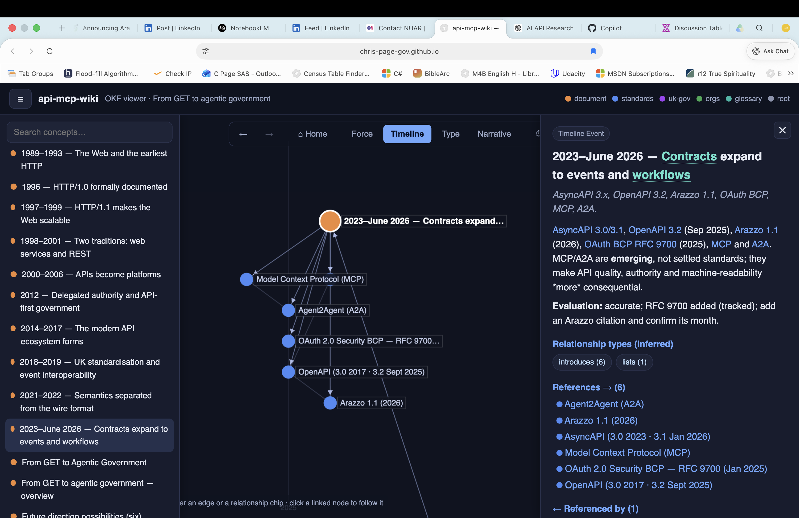
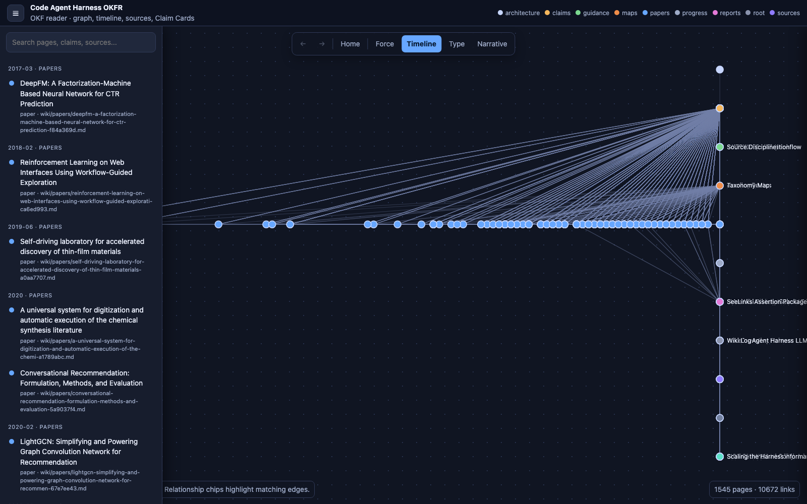
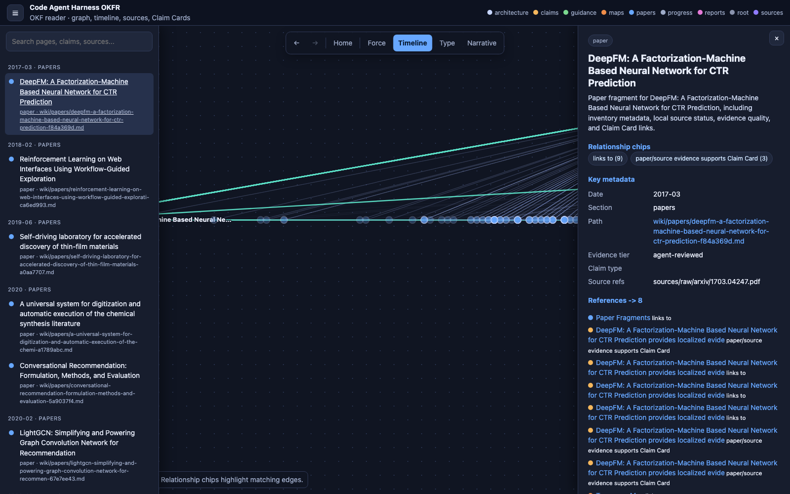

# OKFR UI Specification

This specification records the UI requirements for helping readers understand a
complex OKF pack quickly.

The first implementation follows the `api-mcp-wiki` reader pattern:

- A hamburger concept/timeline list for entry and reorientation.
- A central graph with `Force`, `Timeline`, `Type`, and `Narrative` layouts.
- A right detail panel with concise summary, evaluation/status, relationship
  chips, references, and referenced-by links.
- Navigation history for back, forward, and home.
- Tooltip and hover behavior for nodes, edges, and relationship chips.
- Tile fronts limited to high-ink-ratio signals, with fuller source/evidence
  detail on the back.
- Stack-of-cards views for small comparable sets such as related Claim Cards,
  source clusters, timeline event groups, and competing evidence/gap cards.

## Screenshots

Reference implementation from `api-mcp-wiki`:

Generated Code Agent Harness OKFR timeline/graph overview:

Generated Code Agent Harness OKFR right detail panel:

## Data Contract

An OKFR SeeLinks pack must set:

- `meta.kind = "okfr-pack"`
- `meta.packKind = "okfr"`
- `meta.okf.version = "0.1"`
- `meta.okfr.display = "graph-reader"`

Items represent OKF pages and use stable repo-relative IDs. Graph nodes reuse
existing SeeLinks node kinds where possible:

- `article` for topics, guidance, maps, and root pages.
- `document` for paper fragments.
- `source` for source notes.
- `assertion` for Claim Cards.
- `fragment` for templates or evidence snippets.
- `output` for reports and evidence packets.

Graph edges should use existing SeeLinks edge kinds:

- `links_to`
- `mentions`
- `cites`
- `derived_from`
- `evidences`
- `used_in_output`

When a relationship label is inferred rather than directly asserted, store:

- `edge.metadata.relationship_label`
- `edge.metadata.inferred = true`

## Layout Modes

- Force: good for local neighbourhood exploration around a selected entry.
- Timeline: x-axis is inferred date; y-axis clusters by source section/type.
- Type: clusters by OKF page type and wiki section.
- Narrative: follows `okfr_order` where available, otherwise section order.

## Right Panel Qualification

The right panel should receive information that is needed for interpretation
but too dense for a tile:

- Summary and evaluation/status.
- Key source and evidence metadata.
- Relationship chips.
- References and referenced-by links.
- Source-review caveats.
- External recheck warnings.

## Tile Qualification

The front of a SeeLinks tile should show only:

- Concise title.
- Type/date badge.
- One-line summary.
- One key status or confidence signal.

The back of a tile can show:

- Source/evidence summary.
- Relationship counts.
- Source refs and wiki paths.
- Review actions.

Fields that need comparison across several records should not be squeezed into
one tile. Use a stack of cards.

## Stack-Of-Cards Qualification

Use a card stack for bounded comparison sets:

- Related Claim Cards for one topic.
- Competing evidence and gap cards.
- Source clusters under one publication or organisation.
- Timeline event groups.
- Similar procurement/conformance controls.

The stack should keep each card individually readable and expose shared
comparison facets such as date, source, evidence tier, relationship type, and
confidence.

## Validation Expectations

- `python3 tools/check_okf.py` must pass.
- `python3 tools/build_okf_graph.py --check` must pass.
- `python3 tools/build_okfr_seelinks_pack.py --check` must pass.
- `python3 tools/build_okfr_site.py --check` must pass.
- No generated reader artifact may embed local-only raw source blobs.
- Agent-generated notes must not be labelled `human-reviewed`.
