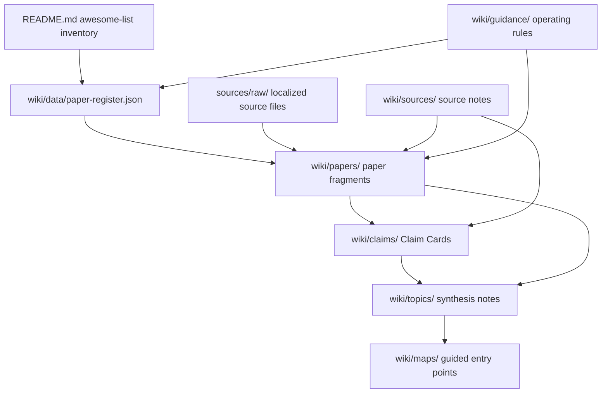

# LLM-Wiki Architecture

## Layers

## Responsibilities

- `README.md` remains the public inventory and high-level project surface.
- `sources/raw/` stores localized raw evidence and should be treated as
  immutable after files are added.
- `wiki/sources/` records source status, use boundaries, and source-backed
  claims.
- `wiki/papers/` gives each paper or external reference a stable wiki fragment.
- `wiki/claims/` stores atomic source-bounded Claim Cards with explicit review
  status, source refs, locators, and related topics.
- `wiki/topics/` synthesizes the survey's conceptual structure.
- `wiki/maps/` gives humans and agents entry routes through the graph.
- `wiki/data/` stores registers for validation and scripted updates.

## Local Adaptation

The first practical target is usefulness for the Code as Agent Harness survey,
not perfect download completeness. A paper can have a wiki fragment before its
PDF or page is localized, provided the fragment clearly records fetch status and
does not make unsupported content claims.

After localization, the practical target becomes claim granularity. Generated
cards start as `agent-drafted`, local validation promotes traceable cards to
`agent-reviewed`, and separate reviewer manifests can promote selected cards to
`cross-agent-reviewed`. `human-reviewed` is reserved for named human review.
